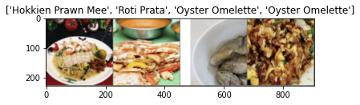

EE4414 Team Practice
==============================================

In this team practice, you will design Convolutional Neural Network(s) to classify food images.


```python
%matplotlib inline
```


```python
from __future__ import print_function, division

import torch
import torch.nn as nn
import torch.optim as optim
from torch.optim import lr_scheduler
import numpy as np
import torchvision
from torchvision import models, transforms
from torchvision.datasets.folder import make_dataset
from PIL import Image
import matplotlib.pyplot as plt
import time
import os
import copy


plt.ion()   # interactive mode
```


    <matplotlib.pyplot._IonContext at 0x7f0a9c3a20d0>


## 1. Loading data

Define the dataset, dataloader, and the data augmentation pipeline.

The code below loads 5 classes from all 12 classes in the dataset. You need to modify it to load only the classes that you need.

***Note: For correctly assessing your code, do not change the file structure of the dataset. Use Pytorch data loading utility (`torch.utils.data`) for customizing your dataset.***


```python
# Define the dataset class
class sg_food_dataset(torch.utils.data.dataset.Dataset):
    def __init__(self, root, class_id, transform=None):
        self.class_id = class_id
        self.root = root
        all_classes = sorted(entry.name for entry in os.scandir(root) if entry.is_dir())
        if not all_classes:
            raise FileNotFoundError(f"Couldn't find any class folder in {directory}.")
        self.classes = [all_classes[x] for x in class_id]
        self.class_to_idx = {cls_name: i for i, cls_name in enumerate(self.classes)}

        self.samples = make_dataset(self.root, self.class_to_idx, extensions=('jpg'))
        self.transform = transform

    def __len__(self):
        return len(self.samples)

    def __getitem__(self, idx):
        path, target = self.samples[idx]
        with open(path, "rb") as f:
            sample = Image.open(f).convert('RGB')
        if self.transform is not None:
            sample = self.transform(sample)
        return sample, target

```


```python
# Data augmentation and normalization for training
data_transforms = {
    'train': transforms.Compose([
        # Define data preparation operations for training set here.
        # Tips: Use torchvision.transforms
        #       https://pytorch.org/vision/stable/transforms.html
        #       Normally this should at least contain resizing (Resize) and data format converting (ToTensor).
        transforms.RandomResizedCrop(224),
        transforms.RandomHorizontalFlip(),
        transforms.ToTensor(),
        transforms.Normalize([0.485, 0.456, 0.406], [0.229, 0.224, 0.225]) # ImageNet prior
    ]),
    'val': transforms.Compose([
        # Define data preparation operations for testing/validation set here.
        transforms.Resize(256),
        transforms.CenterCrop(224),
        transforms.ToTensor(),
        transforms.Normalize([0.485, 0.456, 0.406], [0.229, 0.224, 0.225]) # ImageNet prior
    ]),
}

data_dir = os.path.join('./', 'sg_food')
subfolder = {'train': 'train', 'val': 'val'}

# Define the dataset
selected_classes = [3,5,7,8,9]
n_classes = len(selected_classes)
image_datasets = {x: sg_food_dataset(root=os.path.join(data_dir, subfolder[x]),
                                     class_id=selected_classes,
                                     transform=data_transforms[x]) 
                  for x in ['train', 'val']}
class_names = image_datasets['train'].classes
print('selected classes:\n    id: {}\n    name: {}'.format(selected_classes, class_names))

# Define the dataloader
batch_size = 64
dataloaders = {x: torch.utils.data.DataLoader(image_datasets[x], batch_size=batch_size,
                                             shuffle=True, num_workers=0)
              for x in ['train', 'val']}

dataset_sizes = {x: len(image_datasets[x]) for x in ['train', 'val']}

device = torch.device("cuda:0" if torch.cuda.is_available() else "cpu")
```

    selected classes:
        id: [3, 5, 7, 8, 9]
        name: ['Hokkien Prawn Mee', 'Laksa', 'Oyster Omelette', 'Roast Meat Rice', 'Roti Prata']


## 2. Visualizing the dataset
Fetch a batch of training data from the dataset and visualize them. 


```python
def imshow(inp, title=None):
    """Imshow for Tensor."""
    inp = inp.numpy().transpose((1, 2, 0))
    mean = np.array([0.485, 0.456, 0.406])
    std = np.array([0.229, 0.224, 0.225])
    inp = std * inp + mean
    inp = np.clip(inp, 0, 1)
    plt.imshow(inp)
    if title is not None:
        plt.title(title)
    plt.pause(0.001)  # pause a bit so that plots are updated


# Get a batch of training data
inputs, classes = next(iter(dataloaders['train']))

# Make a grid from batch
out = torchvision.utils.make_grid(inputs[:4])

imshow(out, title=[class_names[x] for x in classes[:4]])
```


    

    


## 3. Defining function to train the model

Use a pre-trained CNN model with transfer learning techniques to classify the 5 food categories.

(Note: The provided code is only for reference. You can modify the code whichever way you want.)


```python
def train_model(model, criterion, optimizer, scheduler, num_epochs=24):
    since = time.time()

    best_model_wts = copy.deepcopy(model.state_dict())
    best_acc = 0.0
    
    loss_list = []
    acc_list = []
    
    loss_list_val = []
    acc_list_val = []
    for epoch in range(num_epochs):
        print('Epoch {}/{}'.format(epoch, num_epochs - 1))
        print('-' * 10)
        t1 = time.time()

        # Each epoch has a training and validation phase
        for phase in ['train', 'val']:
            if phase == 'train':
                model.train()  # Set model to training mode
            else:
                model.eval()   # Set model to evaluate mode

            running_loss = 0.0
            running_corrects = 0

            # Iterate over data.
            for inputs, labels in dataloaders[phase]:
                inputs = inputs.to(device)
                labels = labels.to(device)

                # zero the parameter gradients
                optimizer.zero_grad()

                # forward
                # track history if only in train
                with torch.set_grad_enabled(phase == 'train'):
                    outputs = model(inputs)
                    _, preds = torch.max(outputs, 1)
                    loss = criterion(outputs, labels)

                    # backward + optimize only if in training phase
                    if phase == 'train':
                        loss.backward()
                        optimizer.step()

                # statistics
                running_loss += loss.item() * inputs.size(0)
                running_corrects += torch.sum(preds == labels.data)
                
            if phase == 'train':
                scheduler.step()
            
            
            epoch_loss = running_loss / dataset_sizes[phase]
            epoch_acc = running_corrects.double() / dataset_sizes[phase]
            
            if phase == 'train':
                ## APPEND LOSS AND ACCURACY
                loss_list.append(epoch_loss)
                acc_list.append(epoch_acc)
            else:
                ## APPEND LOSS AND ACCURACY
                loss_list_val.append(epoch_loss)
                acc_list_val.append(epoch_acc)

            print('{} Loss: {:.4f} Acc: {:.4f}'.format(
                phase, epoch_loss, epoch_acc))
            
            
            
            # deep copy the model
            if phase == 'val' and epoch_acc > best_acc:
                best_acc = epoch_acc
                best_model_wts = copy.deepcopy(model.state_dict())

        t2=time.time()
        print('Time:'+str(t2-t1))
        print()
        

    time_elapsed = time.time() - since
    print('Training complete in {:.0f}m {:.0f}s'.format(
        time_elapsed // 60, time_elapsed % 60))
    print('Best val Acc: {:4f}'.format(best_acc))

    # load best model weights
    model.load_state_dict(best_model_wts)
    return model,loss_list,acc_list,loss_list_val,acc_list_val
```

## 3.2 Defining Function to Vsualize Model


```python
def visualize_model(model, num_images=6):
    was_training = model.training
    model.eval()
    images_so_far = 0
    fig = plt.figure()

    with torch.no_grad():
        for i, (inputs, labels) in enumerate(dataloaders['val']):
            inputs = inputs.to(device)
            labels = labels.to(device)

            outputs = model(inputs)
            _, preds = torch.max(outputs, 1)

            for j in range(inputs.size()[0]):
                images_so_far += 1
                ax = plt.subplot(num_images//2, 2, images_so_far)
                ax.axis('off')
                ax.set_title('predicted: {}'.format(class_names[preds[j]]))
                imshow(inputs.cpu().data[j])

                if images_so_far == num_images:
                    model.train(mode=was_training)
                    return
        model.train(mode=was_training)
```


```python

```

## 4. Training and validating the model

Train your model for minimum 3 epochs.

### 4.1 Loading pretrained model and defining new classfier layer


```python
# 1. Load the pretrained model and extract the intermediate features.
# Tips:     Use torchvision.models
#           https://pytorch.org/vision/stable/models.html#classification

# (code)

model = models.efficientnet_b3(pretrained=True)

# 2. Modify the pretrain model for your task.


for param in model.parameters():
    param.requires_grad = False

num_ftrs = model.classifier[-1].in_features
model.classifier[-1] = nn.Linear(num_ftrs, 5)

# # (code)

# # 3. Choose your loss function, optimizer, etc.

criterion = nn.CrossEntropyLoss()

# # Observe that only parameters of final layer are being optimized as
# # opposed to before.
optimizer_conv = optim.SGD(model.classifier.parameters(), lr=0.01, momentum=0.9)
# optimizer_conv = optim.Adam(model.classifier.parameters())

exp_lr_scheduler = lr_scheduler.StepLR(optimizer_conv, step_size=7, gamma=0.1)
# (code)
```

    Downloading: "https://download.pytorch.org/models/efficientnet_b3_rwightman-cf984f9c.pth" to /home/aishik/.cache/torch/hub/checkpoints/efficientnet_b3_rwightman-cf984f9c.pth


      0%|          | 0.00/47.2M [00:00<?, ?B/s]


### 4.2 Printing and visualizing the modified model


```python
# TODO
print(model)
```

    EfficientNet(
      (features): Sequential(
        (0): ConvNormActivation(
          (0): Conv2d(3, 40, kernel_size=(3, 3), stride=(2, 2), padding=(1, 1), bias=False)
          (1): BatchNorm2d(40, eps=1e-05, momentum=0.1, affine=True, track_running_stats=True)
          (2): SiLU(inplace=True)
        )
        (1): Sequential(
          (0): MBConv(
            (block): Sequential(
              (0): ConvNormActivation(
                (0): Conv2d(40, 40, kernel_size=(3, 3), stride=(1, 1), padding=(1, 1), groups=40, bias=False)
                (1): BatchNorm2d(40, eps=1e-05, momentum=0.1, affine=True, track_running_stats=True)
                (2): SiLU(inplace=True)
              )
              (1): SqueezeExcitation(
                (avgpool): AdaptiveAvgPool2d(output_size=1)
                (fc1): Conv2d(40, 10, kernel_size=(1, 1), stride=(1, 1))
                (fc2): Conv2d(10, 40, kernel_size=(1, 1), stride=(1, 1))
                (activation): SiLU(inplace=True)
                (scale_activation): Sigmoid()
              )
              (2): ConvNormActivation(
                (0): Conv2d(40, 24, kernel_size=(1, 1), stride=(1, 1), bias=False)
                (1): BatchNorm2d(24, eps=1e-05, momentum=0.1, affine=True, track_running_stats=True)
              )
            )
            (stochastic_depth): StochasticDepth(p=0.0, mode=row)
          )
          (1): MBConv(
            (block): Sequential(
              (0): ConvNormActivation(
                (0): Conv2d(24, 24, kernel_size=(3, 3), stride=(1, 1), padding=(1, 1), groups=24, bias=False)
                (1): BatchNorm2d(24, eps=1e-05, momentum=0.1, affine=True, track_running_stats=True)
                (2): SiLU(inplace=True)
              )
              (1): SqueezeExcitation(
                (avgpool): AdaptiveAvgPool2d(output_size=1)
                (fc1): Conv2d(24, 6, kernel_size=(1, 1), stride=(1, 1))
                (fc2): Conv2d(6, 24, kernel_size=(1, 1), stride=(1, 1))
                (activation): SiLU(inplace=True)
                (scale_activation): Sigmoid()
              )
              (2): ConvNormActivation(
                (0): Conv2d(24, 24, kernel_size=(1, 1), stride=(1, 1), bias=False)
                (1): BatchNorm2d(24, eps=1e-05, momentum=0.1, affine=True, track_running_stats=True)
              )
            )
            (stochastic_depth): StochasticDepth(p=0.007692307692307693, mode=row)
          )
        )
        (2): Sequential(
          (0): MBConv(
            (block): Sequential(
              (0): ConvNormActivation(
                (0): Conv2d(24, 144, kernel_size=(1, 1), stride=(1, 1), bias=False)
                (1): BatchNorm2d(144, eps=1e-05, momentum=0.1, affine=True, track_running_stats=True)
                (2): SiLU(inplace=True)
              )
              (1): ConvNormActivation(
                (0): Conv2d(144, 144, kernel_size=(3, 3), stride=(2, 2), padding=(1, 1), groups=144, bias=False)
                (1): BatchNorm2d(144, eps=1e-05, momentum=0.1, affine=True, track_running_stats=True)
                (2): SiLU(inplace=True)
              )
              (2): SqueezeExcitation(
                (avgpool): AdaptiveAvgPool2d(output_size=1)
                (fc1): Conv2d(144, 6, kernel_size=(1, 1), stride=(1, 1))
                (fc2): Conv2d(6, 144, kernel_size=(1, 1), stride=(1, 1))
                (activation): SiLU(inplace=True)
                (scale_activation): Sigmoid()
              )
              (3): ConvNormActivation(
                (0): Conv2d(144, 32, kernel_size=(1, 1), stride=(1, 1), bias=False)
                (1): BatchNorm2d(32, eps=1e-05, momentum=0.1, affine=True, track_running_stats=True)
              )
            )
            (stochastic_depth): StochasticDepth(p=0.015384615384615385, mode=row)
          )
          (1): MBConv(
            (block): Sequential(
              (0): ConvNormActivation(
                (0): Conv2d(32, 192, kernel_size=(1, 1), stride=(1, 1), bias=False)
                (1): BatchNorm2d(192, eps=1e-05, momentum=0.1, affine=True, track_running_stats=True)
                (2): SiLU(inplace=True)
              )
              (1): ConvNormActivation(
                (0): Conv2d(192, 192, kernel_size=(3, 3), stride=(1, 1), padding=(1, 1), groups=192, bias=False)
                (1): BatchNorm2d(192, eps=1e-05, momentum=0.1, affine=True, track_running_stats=True)
                (2): SiLU(inplace=True)
              )
              (2): SqueezeExcitation(
                (avgpool): AdaptiveAvgPool2d(output_size=1)
                (fc1): Conv2d(192, 8, kernel_size=(1, 1), stride=(1, 1))
                (fc2): Conv2d(8, 192, kernel_size=(1, 1), stride=(1, 1))
                (activation): SiLU(inplace=True)
                (scale_activation): Sigmoid()
              )
              (3): ConvNormActivation(
                (0): Conv2d(192, 32, kernel_size=(1, 1), stride=(1, 1), bias=False)
                (1): BatchNorm2d(32, eps=1e-05, momentum=0.1, affine=True, track_running_stats=True)
              )
            )
            (stochastic_depth): StochasticDepth(p=0.02307692307692308, mode=row)
          )
          (2): MBConv(
            (block): Sequential(
              (0): ConvNormActivation(
                (0): Conv2d(32, 192, kernel_size=(1, 1), stride=(1, 1), bias=False)
                (1): BatchNorm2d(192, eps=1e-05, momentum=0.1, affine=True, track_running_stats=True)
                (2): SiLU(inplace=True)
              )
              (1): ConvNormActivation(
                (0): Conv2d(192, 192, kernel_size=(3, 3), stride=(1, 1), padding=(1, 1), groups=192, bias=False)
                (1): BatchNorm2d(192, eps=1e-05, momentum=0.1, affine=True, track_running_stats=True)
                (2): SiLU(inplace=True)
              )
              (2): SqueezeExcitation(
                (avgpool): AdaptiveAvgPool2d(output_size=1)
                (fc1): Conv2d(192, 8, kernel_size=(1, 1), stride=(1, 1))
                (fc2): Conv2d(8, 192, kernel_size=(1, 1), stride=(1, 1))
                (activation): SiLU(inplace=True)
                (scale_activation): Sigmoid()
              )
              (3): ConvNormActivation(
                (0): Conv2d(192, 32, kernel_size=(1, 1), stride=(1, 1), bias=False)
                (1): BatchNorm2d(32, eps=1e-05, momentum=0.1, affine=True, track_running_stats=True)
              )
            )
            (stochastic_depth): StochasticDepth(p=0.03076923076923077, mode=row)
          )
        )
        (3): Sequential(
          (0): MBConv(
            (block): Sequential(
              (0): ConvNormActivation(
                (0): Conv2d(32, 192, kernel_size=(1, 1), stride=(1, 1), bias=False)
                (1): BatchNorm2d(192, eps=1e-05, momentum=0.1, affine=True, track_running_stats=True)
                (2): SiLU(inplace=True)
              )
              (1): ConvNormActivation(
                (0): Conv2d(192, 192, kernel_size=(5, 5), stride=(2, 2), padding=(2, 2), groups=192, bias=False)
                (1): BatchNorm2d(192, eps=1e-05, momentum=0.1, affine=True, track_running_stats=True)
                (2): SiLU(inplace=True)
              )
              (2): SqueezeExcitation(
                (avgpool): AdaptiveAvgPool2d(output_size=1)
                (fc1): Conv2d(192, 8, kernel_size=(1, 1), stride=(1, 1))
                (fc2): Conv2d(8, 192, kernel_size=(1, 1), stride=(1, 1))
                (activation): SiLU(inplace=True)
                (scale_activation): Sigmoid()
              )
              (3): ConvNormActivation(
                (0): Conv2d(192, 48, kernel_size=(1, 1), stride=(1, 1), bias=False)
                (1): BatchNorm2d(48, eps=1e-05, momentum=0.1, affine=True, track_running_stats=True)
              )
            )
            (stochastic_depth): StochasticDepth(p=0.038461538461538464, mode=row)
          )
          (1): MBConv(
            (block): Sequential(
              (0): ConvNormActivation(
                (0): Conv2d(48, 288, kernel_size=(1, 1), stride=(1, 1), bias=False)
                (1): BatchNorm2d(288, eps=1e-05, momentum=0.1, affine=True, track_running_stats=True)
                (2): SiLU(inplace=True)
              )
              (1): ConvNormActivation(
                (0): Conv2d(288, 288, kernel_size=(5, 5), stride=(1, 1), padding=(2, 2), groups=288, bias=False)
                (1): BatchNorm2d(288, eps=1e-05, momentum=0.1, affine=True, track_running_stats=True)
                (2): SiLU(inplace=True)
              )
              (2): SqueezeExcitation(
                (avgpool): AdaptiveAvgPool2d(output_size=1)
                (fc1): Conv2d(288, 12, kernel_size=(1, 1), stride=(1, 1))
                (fc2): Conv2d(12, 288, kernel_size=(1, 1), stride=(1, 1))
                (activation): SiLU(inplace=True)
                (scale_activation): Sigmoid()
              )
              (3): ConvNormActivation(
                (0): Conv2d(288, 48, kernel_size=(1, 1), stride=(1, 1), bias=False)
                (1): BatchNorm2d(48, eps=1e-05, momentum=0.1, affine=True, track_running_stats=True)
              )
            )
            (stochastic_depth): StochasticDepth(p=0.04615384615384616, mode=row)
          )
          (2): MBConv(
            (block): Sequential(
              (0): ConvNormActivation(
                (0): Conv2d(48, 288, kernel_size=(1, 1), stride=(1, 1), bias=False)
                (1): BatchNorm2d(288, eps=1e-05, momentum=0.1, affine=True, track_running_stats=True)
                (2): SiLU(inplace=True)
              )
              (1): ConvNormActivation(
                (0): Conv2d(288, 288, kernel_size=(5, 5), stride=(1, 1), padding=(2, 2), groups=288, bias=False)
                (1): BatchNorm2d(288, eps=1e-05, momentum=0.1, affine=True, track_running_stats=True)
                (2): SiLU(inplace=True)
              )
              (2): SqueezeExcitation(
                (avgpool): AdaptiveAvgPool2d(output_size=1)
                (fc1): Conv2d(288, 12, kernel_size=(1, 1), stride=(1, 1))
                (fc2): Conv2d(12, 288, kernel_size=(1, 1), stride=(1, 1))
                (activation): SiLU(inplace=True)
                (scale_activation): Sigmoid()
              )
              (3): ConvNormActivation(
                (0): Conv2d(288, 48, kernel_size=(1, 1), stride=(1, 1), bias=False)
                (1): BatchNorm2d(48, eps=1e-05, momentum=0.1, affine=True, track_running_stats=True)
              )
            )
            (stochastic_depth): StochasticDepth(p=0.05384615384615385, mode=row)
          )
        )
        (4): Sequential(
          (0): MBConv(
            (block): Sequential(
              (0): ConvNormActivation(
                (0): Conv2d(48, 288, kernel_size=(1, 1), stride=(1, 1), bias=False)
                (1): BatchNorm2d(288, eps=1e-05, momentum=0.1, affine=True, track_running_stats=True)
                (2): SiLU(inplace=True)
              )
              (1): ConvNormActivation(
                (0): Conv2d(288, 288, kernel_size=(3, 3), stride=(2, 2), padding=(1, 1), groups=288, bias=False)
                (1): BatchNorm2d(288, eps=1e-05, momentum=0.1, affine=True, track_running_stats=True)
                (2): SiLU(inplace=True)
              )
              (2): SqueezeExcitation(
                (avgpool): AdaptiveAvgPool2d(output_size=1)
                (fc1): Conv2d(288, 12, kernel_size=(1, 1), stride=(1, 1))
                (fc2): Conv2d(12, 288, kernel_size=(1, 1), stride=(1, 1))
                (activation): SiLU(inplace=True)
                (scale_activation): Sigmoid()
              )
              (3): ConvNormActivation(
                (0): Conv2d(288, 96, kernel_size=(1, 1), stride=(1, 1), bias=False)
                (1): BatchNorm2d(96, eps=1e-05, momentum=0.1, affine=True, track_running_stats=True)
              )
            )
            (stochastic_depth): StochasticDepth(p=0.06153846153846154, mode=row)
          )
          (1): MBConv(
            (block): Sequential(
              (0): ConvNormActivation(
                (0): Conv2d(96, 576, kernel_size=(1, 1), stride=(1, 1), bias=False)
                (1): BatchNorm2d(576, eps=1e-05, momentum=0.1, affine=True, track_running_stats=True)
                (2): SiLU(inplace=True)
              )
              (1): ConvNormActivation(
                (0): Conv2d(576, 576, kernel_size=(3, 3), stride=(1, 1), padding=(1, 1), groups=576, bias=False)
                (1): BatchNorm2d(576, eps=1e-05, momentum=0.1, affine=True, track_running_stats=True)
                (2): SiLU(inplace=True)
              )
              (2): SqueezeExcitation(
                (avgpool): AdaptiveAvgPool2d(output_size=1)
                (fc1): Conv2d(576, 24, kernel_size=(1, 1), stride=(1, 1))
                (fc2): Conv2d(24, 576, kernel_size=(1, 1), stride=(1, 1))
                (activation): SiLU(inplace=True)
                (scale_activation): Sigmoid()
              )
              (3): ConvNormActivation(
                (0): Conv2d(576, 96, kernel_size=(1, 1), stride=(1, 1), bias=False)
                (1): BatchNorm2d(96, eps=1e-05, momentum=0.1, affine=True, track_running_stats=True)
              )
            )
            (stochastic_depth): StochasticDepth(p=0.06923076923076923, mode=row)
          )
          (2): MBConv(
            (block): Sequential(
              (0): ConvNormActivation(
                (0): Conv2d(96, 576, kernel_size=(1, 1), stride=(1, 1), bias=False)
                (1): BatchNorm2d(576, eps=1e-05, momentum=0.1, affine=True, track_running_stats=True)
                (2): SiLU(inplace=True)
              )
              (1): ConvNormActivation(
                (0): Conv2d(576, 576, kernel_size=(3, 3), stride=(1, 1), padding=(1, 1), groups=576, bias=False)
                (1): BatchNorm2d(576, eps=1e-05, momentum=0.1, affine=True, track_running_stats=True)
                (2): SiLU(inplace=True)
              )
              (2): SqueezeExcitation(
                (avgpool): AdaptiveAvgPool2d(output_size=1)
                (fc1): Conv2d(576, 24, kernel_size=(1, 1), stride=(1, 1))
                (fc2): Conv2d(24, 576, kernel_size=(1, 1), stride=(1, 1))
                (activation): SiLU(inplace=True)
                (scale_activation): Sigmoid()
              )
              (3): ConvNormActivation(
                (0): Conv2d(576, 96, kernel_size=(1, 1), stride=(1, 1), bias=False)
                (1): BatchNorm2d(96, eps=1e-05, momentum=0.1, affine=True, track_running_stats=True)
              )
            )
            (stochastic_depth): StochasticDepth(p=0.07692307692307693, mode=row)
          )
          (3): MBConv(
            (block): Sequential(
              (0): ConvNormActivation(
                (0): Conv2d(96, 576, kernel_size=(1, 1), stride=(1, 1), bias=False)
                (1): BatchNorm2d(576, eps=1e-05, momentum=0.1, affine=True, track_running_stats=True)
                (2): SiLU(inplace=True)
              )
              (1): ConvNormActivation(
                (0): Conv2d(576, 576, kernel_size=(3, 3), stride=(1, 1), padding=(1, 1), groups=576, bias=False)
                (1): BatchNorm2d(576, eps=1e-05, momentum=0.1, affine=True, track_running_stats=True)
                (2): SiLU(inplace=True)
              )
              (2): SqueezeExcitation(
                (avgpool): AdaptiveAvgPool2d(output_size=1)
                (fc1): Conv2d(576, 24, kernel_size=(1, 1), stride=(1, 1))
                (fc2): Conv2d(24, 576, kernel_size=(1, 1), stride=(1, 1))
                (activation): SiLU(inplace=True)
                (scale_activation): Sigmoid()
              )
              (3): ConvNormActivation(
                (0): Conv2d(576, 96, kernel_size=(1, 1), stride=(1, 1), bias=False)
                (1): BatchNorm2d(96, eps=1e-05, momentum=0.1, affine=True, track_running_stats=True)
              )
            )
            (stochastic_depth): StochasticDepth(p=0.08461538461538462, mode=row)
          )
          (4): MBConv(
            (block): Sequential(
              (0): ConvNormActivation(
                (0): Conv2d(96, 576, kernel_size=(1, 1), stride=(1, 1), bias=False)
                (1): BatchNorm2d(576, eps=1e-05, momentum=0.1, affine=True, track_running_stats=True)
                (2): SiLU(inplace=True)
              )
              (1): ConvNormActivation(
                (0): Conv2d(576, 576, kernel_size=(3, 3), stride=(1, 1), padding=(1, 1), groups=576, bias=False)
                (1): BatchNorm2d(576, eps=1e-05, momentum=0.1, affine=True, track_running_stats=True)
                (2): SiLU(inplace=True)
              )
              (2): SqueezeExcitation(
                (avgpool): AdaptiveAvgPool2d(output_size=1)
                (fc1): Conv2d(576, 24, kernel_size=(1, 1), stride=(1, 1))
                (fc2): Conv2d(24, 576, kernel_size=(1, 1), stride=(1, 1))
                (activation): SiLU(inplace=True)
                (scale_activation): Sigmoid()
              )
              (3): ConvNormActivation(
                (0): Conv2d(576, 96, kernel_size=(1, 1), stride=(1, 1), bias=False)
                (1): BatchNorm2d(96, eps=1e-05, momentum=0.1, affine=True, track_running_stats=True)
              )
            )
            (stochastic_depth): StochasticDepth(p=0.09230769230769233, mode=row)
          )
        )
        (5): Sequential(
          (0): MBConv(
            (block): Sequential(
              (0): ConvNormActivation(
                (0): Conv2d(96, 576, kernel_size=(1, 1), stride=(1, 1), bias=False)
                (1): BatchNorm2d(576, eps=1e-05, momentum=0.1, affine=True, track_running_stats=True)
                (2): SiLU(inplace=True)
              )
              (1): ConvNormActivation(
                (0): Conv2d(576, 576, kernel_size=(5, 5), stride=(1, 1), padding=(2, 2), groups=576, bias=False)
                (1): BatchNorm2d(576, eps=1e-05, momentum=0.1, affine=True, track_running_stats=True)
                (2): SiLU(inplace=True)
              )
              (2): SqueezeExcitation(
                (avgpool): AdaptiveAvgPool2d(output_size=1)
                (fc1): Conv2d(576, 24, kernel_size=(1, 1), stride=(1, 1))
                (fc2): Conv2d(24, 576, kernel_size=(1, 1), stride=(1, 1))
                (activation): SiLU(inplace=True)
                (scale_activation): Sigmoid()
              )
              (3): ConvNormActivation(
                (0): Conv2d(576, 136, kernel_size=(1, 1), stride=(1, 1), bias=False)
                (1): BatchNorm2d(136, eps=1e-05, momentum=0.1, affine=True, track_running_stats=True)
              )
            )
            (stochastic_depth): StochasticDepth(p=0.1, mode=row)
          )
          (1): MBConv(
            (block): Sequential(
              (0): ConvNormActivation(
                (0): Conv2d(136, 816, kernel_size=(1, 1), stride=(1, 1), bias=False)
                (1): BatchNorm2d(816, eps=1e-05, momentum=0.1, affine=True, track_running_stats=True)
                (2): SiLU(inplace=True)
              )
              (1): ConvNormActivation(
                (0): Conv2d(816, 816, kernel_size=(5, 5), stride=(1, 1), padding=(2, 2), groups=816, bias=False)
                (1): BatchNorm2d(816, eps=1e-05, momentum=0.1, affine=True, track_running_stats=True)
                (2): SiLU(inplace=True)
              )
              (2): SqueezeExcitation(
                (avgpool): AdaptiveAvgPool2d(output_size=1)
                (fc1): Conv2d(816, 34, kernel_size=(1, 1), stride=(1, 1))
                (fc2): Conv2d(34, 816, kernel_size=(1, 1), stride=(1, 1))
                (activation): SiLU(inplace=True)
                (scale_activation): Sigmoid()
              )
              (3): ConvNormActivation(
                (0): Conv2d(816, 136, kernel_size=(1, 1), stride=(1, 1), bias=False)
                (1): BatchNorm2d(136, eps=1e-05, momentum=0.1, affine=True, track_running_stats=True)
              )
            )
            (stochastic_depth): StochasticDepth(p=0.1076923076923077, mode=row)
          )
          (2): MBConv(
            (block): Sequential(
              (0): ConvNormActivation(
                (0): Conv2d(136, 816, kernel_size=(1, 1), stride=(1, 1), bias=False)
                (1): BatchNorm2d(816, eps=1e-05, momentum=0.1, affine=True, track_running_stats=True)
                (2): SiLU(inplace=True)
              )
              (1): ConvNormActivation(
                (0): Conv2d(816, 816, kernel_size=(5, 5), stride=(1, 1), padding=(2, 2), groups=816, bias=False)
                (1): BatchNorm2d(816, eps=1e-05, momentum=0.1, affine=True, track_running_stats=True)
                (2): SiLU(inplace=True)
              )
              (2): SqueezeExcitation(
                (avgpool): AdaptiveAvgPool2d(output_size=1)
                (fc1): Conv2d(816, 34, kernel_size=(1, 1), stride=(1, 1))
                (fc2): Conv2d(34, 816, kernel_size=(1, 1), stride=(1, 1))
                (activation): SiLU(inplace=True)
                (scale_activation): Sigmoid()
              )
              (3): ConvNormActivation(
                (0): Conv2d(816, 136, kernel_size=(1, 1), stride=(1, 1), bias=False)
                (1): BatchNorm2d(136, eps=1e-05, momentum=0.1, affine=True, track_running_stats=True)
              )
            )
            (stochastic_depth): StochasticDepth(p=0.11538461538461539, mode=row)
          )
          (3): MBConv(
            (block): Sequential(
              (0): ConvNormActivation(
                (0): Conv2d(136, 816, kernel_size=(1, 1), stride=(1, 1), bias=False)
                (1): BatchNorm2d(816, eps=1e-05, momentum=0.1, affine=True, track_running_stats=True)
                (2): SiLU(inplace=True)
              )
              (1): ConvNormActivation(
                (0): Conv2d(816, 816, kernel_size=(5, 5), stride=(1, 1), padding=(2, 2), groups=816, bias=False)
                (1): BatchNorm2d(816, eps=1e-05, momentum=0.1, affine=True, track_running_stats=True)
                (2): SiLU(inplace=True)
              )
              (2): SqueezeExcitation(
                (avgpool): AdaptiveAvgPool2d(output_size=1)
                (fc1): Conv2d(816, 34, kernel_size=(1, 1), stride=(1, 1))
                (fc2): Conv2d(34, 816, kernel_size=(1, 1), stride=(1, 1))
                (activation): SiLU(inplace=True)
                (scale_activation): Sigmoid()
              )
              (3): ConvNormActivation(
                (0): Conv2d(816, 136, kernel_size=(1, 1), stride=(1, 1), bias=False)
                (1): BatchNorm2d(136, eps=1e-05, momentum=0.1, affine=True, track_running_stats=True)
              )
            )
            (stochastic_depth): StochasticDepth(p=0.12307692307692308, mode=row)
          )
          (4): MBConv(
            (block): Sequential(
              (0): ConvNormActivation(
                (0): Conv2d(136, 816, kernel_size=(1, 1), stride=(1, 1), bias=False)
                (1): BatchNorm2d(816, eps=1e-05, momentum=0.1, affine=True, track_running_stats=True)
                (2): SiLU(inplace=True)
              )
              (1): ConvNormActivation(
                (0): Conv2d(816, 816, kernel_size=(5, 5), stride=(1, 1), padding=(2, 2), groups=816, bias=False)
                (1): BatchNorm2d(816, eps=1e-05, momentum=0.1, affine=True, track_running_stats=True)
                (2): SiLU(inplace=True)
              )
              (2): SqueezeExcitation(
                (avgpool): AdaptiveAvgPool2d(output_size=1)
                (fc1): Conv2d(816, 34, kernel_size=(1, 1), stride=(1, 1))
                (fc2): Conv2d(34, 816, kernel_size=(1, 1), stride=(1, 1))
                (activation): SiLU(inplace=True)
                (scale_activation): Sigmoid()
              )
              (3): ConvNormActivation(
                (0): Conv2d(816, 136, kernel_size=(1, 1), stride=(1, 1), bias=False)
                (1): BatchNorm2d(136, eps=1e-05, momentum=0.1, affine=True, track_running_stats=True)
              )
            )
            (stochastic_depth): StochasticDepth(p=0.13076923076923078, mode=row)
          )
        )
        (6): Sequential(
          (0): MBConv(
            (block): Sequential(
              (0): ConvNormActivation(
                (0): Conv2d(136, 816, kernel_size=(1, 1), stride=(1, 1), bias=False)
                (1): BatchNorm2d(816, eps=1e-05, momentum=0.1, affine=True, track_running_stats=True)
                (2): SiLU(inplace=True)
              )
              (1): ConvNormActivation(
                (0): Conv2d(816, 816, kernel_size=(5, 5), stride=(2, 2), padding=(2, 2), groups=816, bias=False)
                (1): BatchNorm2d(816, eps=1e-05, momentum=0.1, affine=True, track_running_stats=True)
                (2): SiLU(inplace=True)
              )
              (2): SqueezeExcitation(
                (avgpool): AdaptiveAvgPool2d(output_size=1)
                (fc1): Conv2d(816, 34, kernel_size=(1, 1), stride=(1, 1))
                (fc2): Conv2d(34, 816, kernel_size=(1, 1), stride=(1, 1))
                (activation): SiLU(inplace=True)
                (scale_activation): Sigmoid()
              )
              (3): ConvNormActivation(
                (0): Conv2d(816, 232, kernel_size=(1, 1), stride=(1, 1), bias=False)
                (1): BatchNorm2d(232, eps=1e-05, momentum=0.1, affine=True, track_running_stats=True)
              )
            )
            (stochastic_depth): StochasticDepth(p=0.13846153846153847, mode=row)
          )
          (1): MBConv(
            (block): Sequential(
              (0): ConvNormActivation(
                (0): Conv2d(232, 1392, kernel_size=(1, 1), stride=(1, 1), bias=False)
                (1): BatchNorm2d(1392, eps=1e-05, momentum=0.1, affine=True, track_running_stats=True)
                (2): SiLU(inplace=True)
              )
              (1): ConvNormActivation(
                (0): Conv2d(1392, 1392, kernel_size=(5, 5), stride=(1, 1), padding=(2, 2), groups=1392, bias=False)
                (1): BatchNorm2d(1392, eps=1e-05, momentum=0.1, affine=True, track_running_stats=True)
                (2): SiLU(inplace=True)
              )
              (2): SqueezeExcitation(
                (avgpool): AdaptiveAvgPool2d(output_size=1)
                (fc1): Conv2d(1392, 58, kernel_size=(1, 1), stride=(1, 1))
                (fc2): Conv2d(58, 1392, kernel_size=(1, 1), stride=(1, 1))
                (activation): SiLU(inplace=True)
                (scale_activation): Sigmoid()
              )
              (3): ConvNormActivation(
                (0): Conv2d(1392, 232, kernel_size=(1, 1), stride=(1, 1), bias=False)
                (1): BatchNorm2d(232, eps=1e-05, momentum=0.1, affine=True, track_running_stats=True)
              )
            )
            (stochastic_depth): StochasticDepth(p=0.14615384615384616, mode=row)
          )
          (2): MBConv(
            (block): Sequential(
              (0): ConvNormActivation(
                (0): Conv2d(232, 1392, kernel_size=(1, 1), stride=(1, 1), bias=False)
                (1): BatchNorm2d(1392, eps=1e-05, momentum=0.1, affine=True, track_running_stats=True)
                (2): SiLU(inplace=True)
              )
              (1): ConvNormActivation(
                (0): Conv2d(1392, 1392, kernel_size=(5, 5), stride=(1, 1), padding=(2, 2), groups=1392, bias=False)
                (1): BatchNorm2d(1392, eps=1e-05, momentum=0.1, affine=True, track_running_stats=True)
                (2): SiLU(inplace=True)
              )
              (2): SqueezeExcitation(
                (avgpool): AdaptiveAvgPool2d(output_size=1)
                (fc1): Conv2d(1392, 58, kernel_size=(1, 1), stride=(1, 1))
                (fc2): Conv2d(58, 1392, kernel_size=(1, 1), stride=(1, 1))
                (activation): SiLU(inplace=True)
                (scale_activation): Sigmoid()
              )
              (3): ConvNormActivation(
                (0): Conv2d(1392, 232, kernel_size=(1, 1), stride=(1, 1), bias=False)
                (1): BatchNorm2d(232, eps=1e-05, momentum=0.1, affine=True, track_running_stats=True)
              )
            )
            (stochastic_depth): StochasticDepth(p=0.15384615384615385, mode=row)
          )
          (3): MBConv(
            (block): Sequential(
              (0): ConvNormActivation(
                (0): Conv2d(232, 1392, kernel_size=(1, 1), stride=(1, 1), bias=False)
                (1): BatchNorm2d(1392, eps=1e-05, momentum=0.1, affine=True, track_running_stats=True)
                (2): SiLU(inplace=True)
              )
              (1): ConvNormActivation(
                (0): Conv2d(1392, 1392, kernel_size=(5, 5), stride=(1, 1), padding=(2, 2), groups=1392, bias=False)
                (1): BatchNorm2d(1392, eps=1e-05, momentum=0.1, affine=True, track_running_stats=True)
                (2): SiLU(inplace=True)
              )
              (2): SqueezeExcitation(
                (avgpool): AdaptiveAvgPool2d(output_size=1)
                (fc1): Conv2d(1392, 58, kernel_size=(1, 1), stride=(1, 1))
                (fc2): Conv2d(58, 1392, kernel_size=(1, 1), stride=(1, 1))
                (activation): SiLU(inplace=True)
                (scale_activation): Sigmoid()
              )
              (3): ConvNormActivation(
                (0): Conv2d(1392, 232, kernel_size=(1, 1), stride=(1, 1), bias=False)
                (1): BatchNorm2d(232, eps=1e-05, momentum=0.1, affine=True, track_running_stats=True)
              )
            )
            (stochastic_depth): StochasticDepth(p=0.16153846153846155, mode=row)
          )
          (4): MBConv(
            (block): Sequential(
              (0): ConvNormActivation(
                (0): Conv2d(232, 1392, kernel_size=(1, 1), stride=(1, 1), bias=False)
                (1): BatchNorm2d(1392, eps=1e-05, momentum=0.1, affine=True, track_running_stats=True)
                (2): SiLU(inplace=True)
              )
              (1): ConvNormActivation(
                (0): Conv2d(1392, 1392, kernel_size=(5, 5), stride=(1, 1), padding=(2, 2), groups=1392, bias=False)
                (1): BatchNorm2d(1392, eps=1e-05, momentum=0.1, affine=True, track_running_stats=True)
                (2): SiLU(inplace=True)
              )
              (2): SqueezeExcitation(
                (avgpool): AdaptiveAvgPool2d(output_size=1)
                (fc1): Conv2d(1392, 58, kernel_size=(1, 1), stride=(1, 1))
                (fc2): Conv2d(58, 1392, kernel_size=(1, 1), stride=(1, 1))
                (activation): SiLU(inplace=True)
                (scale_activation): Sigmoid()
              )
              (3): ConvNormActivation(
                (0): Conv2d(1392, 232, kernel_size=(1, 1), stride=(1, 1), bias=False)
                (1): BatchNorm2d(232, eps=1e-05, momentum=0.1, affine=True, track_running_stats=True)
              )
            )
            (stochastic_depth): StochasticDepth(p=0.16923076923076924, mode=row)
          )
          (5): MBConv(
            (block): Sequential(
              (0): ConvNormActivation(
                (0): Conv2d(232, 1392, kernel_size=(1, 1), stride=(1, 1), bias=False)
                (1): BatchNorm2d(1392, eps=1e-05, momentum=0.1, affine=True, track_running_stats=True)
                (2): SiLU(inplace=True)
              )
              (1): ConvNormActivation(
                (0): Conv2d(1392, 1392, kernel_size=(5, 5), stride=(1, 1), padding=(2, 2), groups=1392, bias=False)
                (1): BatchNorm2d(1392, eps=1e-05, momentum=0.1, affine=True, track_running_stats=True)
                (2): SiLU(inplace=True)
              )
              (2): SqueezeExcitation(
                (avgpool): AdaptiveAvgPool2d(output_size=1)
                (fc1): Conv2d(1392, 58, kernel_size=(1, 1), stride=(1, 1))
                (fc2): Conv2d(58, 1392, kernel_size=(1, 1), stride=(1, 1))
                (activation): SiLU(inplace=True)
                (scale_activation): Sigmoid()
              )
              (3): ConvNormActivation(
                (0): Conv2d(1392, 232, kernel_size=(1, 1), stride=(1, 1), bias=False)
                (1): BatchNorm2d(232, eps=1e-05, momentum=0.1, affine=True, track_running_stats=True)
              )
            )
            (stochastic_depth): StochasticDepth(p=0.17692307692307693, mode=row)
          )
        )
        (7): Sequential(
          (0): MBConv(
            (block): Sequential(
              (0): ConvNormActivation(
                (0): Conv2d(232, 1392, kernel_size=(1, 1), stride=(1, 1), bias=False)
                (1): BatchNorm2d(1392, eps=1e-05, momentum=0.1, affine=True, track_running_stats=True)
                (2): SiLU(inplace=True)
              )
              (1): ConvNormActivation(
                (0): Conv2d(1392, 1392, kernel_size=(3, 3), stride=(1, 1), padding=(1, 1), groups=1392, bias=False)
                (1): BatchNorm2d(1392, eps=1e-05, momentum=0.1, affine=True, track_running_stats=True)
                (2): SiLU(inplace=True)
              )
              (2): SqueezeExcitation(
                (avgpool): AdaptiveAvgPool2d(output_size=1)
                (fc1): Conv2d(1392, 58, kernel_size=(1, 1), stride=(1, 1))
                (fc2): Conv2d(58, 1392, kernel_size=(1, 1), stride=(1, 1))
                (activation): SiLU(inplace=True)
                (scale_activation): Sigmoid()
              )
              (3): ConvNormActivation(
                (0): Conv2d(1392, 384, kernel_size=(1, 1), stride=(1, 1), bias=False)
                (1): BatchNorm2d(384, eps=1e-05, momentum=0.1, affine=True, track_running_stats=True)
              )
            )
            (stochastic_depth): StochasticDepth(p=0.18461538461538465, mode=row)
          )
          (1): MBConv(
            (block): Sequential(
              (0): ConvNormActivation(
                (0): Conv2d(384, 2304, kernel_size=(1, 1), stride=(1, 1), bias=False)
                (1): BatchNorm2d(2304, eps=1e-05, momentum=0.1, affine=True, track_running_stats=True)
                (2): SiLU(inplace=True)
              )
              (1): ConvNormActivation(
                (0): Conv2d(2304, 2304, kernel_size=(3, 3), stride=(1, 1), padding=(1, 1), groups=2304, bias=False)
                (1): BatchNorm2d(2304, eps=1e-05, momentum=0.1, affine=True, track_running_stats=True)
                (2): SiLU(inplace=True)
              )
              (2): SqueezeExcitation(
                (avgpool): AdaptiveAvgPool2d(output_size=1)
                (fc1): Conv2d(2304, 96, kernel_size=(1, 1), stride=(1, 1))
                (fc2): Conv2d(96, 2304, kernel_size=(1, 1), stride=(1, 1))
                (activation): SiLU(inplace=True)
                (scale_activation): Sigmoid()
              )
              (3): ConvNormActivation(
                (0): Conv2d(2304, 384, kernel_size=(1, 1), stride=(1, 1), bias=False)
                (1): BatchNorm2d(384, eps=1e-05, momentum=0.1, affine=True, track_running_stats=True)
              )
            )
            (stochastic_depth): StochasticDepth(p=0.19230769230769232, mode=row)
          )
        )
        (8): ConvNormActivation(
          (0): Conv2d(384, 1536, kernel_size=(1, 1), stride=(1, 1), bias=False)
          (1): BatchNorm2d(1536, eps=1e-05, momentum=0.1, affine=True, track_running_stats=True)
          (2): SiLU(inplace=True)
        )
      )
      (avgpool): AdaptiveAvgPool2d(output_size=1)
      (classifier): Sequential(
        (0): Dropout(p=0.3, inplace=True)
        (1): Linear(in_features=1536, out_features=5, bias=True)
      )
    )


```python
# TODO
from torchsummary import summary
summary(model, input_size=(3,224,224))
```

    ----------------------------------------------------------------
            Layer (type)               Output Shape         Param #
    ================================================================
                Conv2d-1         [-1, 40, 112, 112]           1,080
           BatchNorm2d-2         [-1, 40, 112, 112]              80
                  SiLU-3         [-1, 40, 112, 112]               0
                Conv2d-4         [-1, 40, 112, 112]             360
           BatchNorm2d-5         [-1, 40, 112, 112]              80
                  SiLU-6         [-1, 40, 112, 112]               0
     AdaptiveAvgPool2d-7             [-1, 40, 1, 1]               0
                Conv2d-8             [-1, 10, 1, 1]             410
                  SiLU-9             [-1, 10, 1, 1]               0
               Conv2d-10             [-1, 40, 1, 1]             440
              Sigmoid-11             [-1, 40, 1, 1]               0
    SqueezeExcitation-12         [-1, 40, 112, 112]               0
               Conv2d-13         [-1, 24, 112, 112]             960
          BatchNorm2d-14         [-1, 24, 112, 112]              48
               MBConv-15         [-1, 24, 112, 112]               0
               Conv2d-16         [-1, 24, 112, 112]             216
          BatchNorm2d-17         [-1, 24, 112, 112]              48
                 SiLU-18         [-1, 24, 112, 112]               0
    AdaptiveAvgPool2d-19             [-1, 24, 1, 1]               0
               Conv2d-20              [-1, 6, 1, 1]             150
                 SiLU-21              [-1, 6, 1, 1]               0
               Conv2d-22             [-1, 24, 1, 1]             168
              Sigmoid-23             [-1, 24, 1, 1]               0
    SqueezeExcitation-24         [-1, 24, 112, 112]               0
               Conv2d-25         [-1, 24, 112, 112]             576
          BatchNorm2d-26         [-1, 24, 112, 112]              48
      StochasticDepth-27         [-1, 24, 112, 112]               0
               MBConv-28         [-1, 24, 112, 112]               0
               Conv2d-29        [-1, 144, 112, 112]           3,456
          BatchNorm2d-30        [-1, 144, 112, 112]             288
                 SiLU-31        [-1, 144, 112, 112]               0
               Conv2d-32          [-1, 144, 56, 56]           1,296
          BatchNorm2d-33          [-1, 144, 56, 56]             288
                 SiLU-34          [-1, 144, 56, 56]               0
    AdaptiveAvgPool2d-35            [-1, 144, 1, 1]               0
               Conv2d-36              [-1, 6, 1, 1]             870
                 SiLU-37              [-1, 6, 1, 1]               0
               Conv2d-38            [-1, 144, 1, 1]           1,008
              Sigmoid-39            [-1, 144, 1, 1]               0
    SqueezeExcitation-40          [-1, 144, 56, 56]               0
               Conv2d-41           [-1, 32, 56, 56]           4,608
          BatchNorm2d-42           [-1, 32, 56, 56]              64
               MBConv-43           [-1, 32, 56, 56]               0
               Conv2d-44          [-1, 192, 56, 56]           6,144
          BatchNorm2d-45          [-1, 192, 56, 56]             384
                 SiLU-46          [-1, 192, 56, 56]               0
               Conv2d-47          [-1, 192, 56, 56]           1,728
          BatchNorm2d-48          [-1, 192, 56, 56]             384
                 SiLU-49          [-1, 192, 56, 56]               0
    AdaptiveAvgPool2d-50            [-1, 192, 1, 1]               0
               Conv2d-51              [-1, 8, 1, 1]           1,544
                 SiLU-52              [-1, 8, 1, 1]               0
               Conv2d-53            [-1, 192, 1, 1]           1,728
              Sigmoid-54            [-1, 192, 1, 1]               0
    SqueezeExcitation-55          [-1, 192, 56, 56]               0
               Conv2d-56           [-1, 32, 56, 56]           6,144
          BatchNorm2d-57           [-1, 32, 56, 56]              64
      StochasticDepth-58           [-1, 32, 56, 56]               0
               MBConv-59           [-1, 32, 56, 56]               0
               Conv2d-60          [-1, 192, 56, 56]           6,144
          BatchNorm2d-61          [-1, 192, 56, 56]             384
                 SiLU-62          [-1, 192, 56, 56]               0
               Conv2d-63          [-1, 192, 56, 56]           1,728
          BatchNorm2d-64          [-1, 192, 56, 56]             384
                 SiLU-65          [-1, 192, 56, 56]               0
    AdaptiveAvgPool2d-66            [-1, 192, 1, 1]               0
               Conv2d-67              [-1, 8, 1, 1]           1,544
                 SiLU-68              [-1, 8, 1, 1]               0
               Conv2d-69            [-1, 192, 1, 1]           1,728
              Sigmoid-70            [-1, 192, 1, 1]               0
    SqueezeExcitation-71          [-1, 192, 56, 56]               0
               Conv2d-72           [-1, 32, 56, 56]           6,144
          BatchNorm2d-73           [-1, 32, 56, 56]              64
      StochasticDepth-74           [-1, 32, 56, 56]               0
               MBConv-75           [-1, 32, 56, 56]               0
               Conv2d-76          [-1, 192, 56, 56]           6,144
          BatchNorm2d-77          [-1, 192, 56, 56]             384
                 SiLU-78          [-1, 192, 56, 56]               0
               Conv2d-79          [-1, 192, 28, 28]           4,800
          BatchNorm2d-80          [-1, 192, 28, 28]             384
                 SiLU-81          [-1, 192, 28, 28]               0
    AdaptiveAvgPool2d-82            [-1, 192, 1, 1]               0
               Conv2d-83              [-1, 8, 1, 1]           1,544
                 SiLU-84              [-1, 8, 1, 1]               0
               Conv2d-85            [-1, 192, 1, 1]           1,728
              Sigmoid-86            [-1, 192, 1, 1]               0
    SqueezeExcitation-87          [-1, 192, 28, 28]               0
               Conv2d-88           [-1, 48, 28, 28]           9,216
          BatchNorm2d-89           [-1, 48, 28, 28]              96
               MBConv-90           [-1, 48, 28, 28]               0
               Conv2d-91          [-1, 288, 28, 28]          13,824
          BatchNorm2d-92          [-1, 288, 28, 28]             576
                 SiLU-93          [-1, 288, 28, 28]               0
               Conv2d-94          [-1, 288, 28, 28]           7,200
          BatchNorm2d-95          [-1, 288, 28, 28]             576
                 SiLU-96          [-1, 288, 28, 28]               0
    AdaptiveAvgPool2d-97            [-1, 288, 1, 1]               0
               Conv2d-98             [-1, 12, 1, 1]           3,468
                 SiLU-99             [-1, 12, 1, 1]               0
              Conv2d-100            [-1, 288, 1, 1]           3,744
             Sigmoid-101            [-1, 288, 1, 1]               0
    SqueezeExcitation-102          [-1, 288, 28, 28]               0
              Conv2d-103           [-1, 48, 28, 28]          13,824
         BatchNorm2d-104           [-1, 48, 28, 28]              96
     StochasticDepth-105           [-1, 48, 28, 28]               0
              MBConv-106           [-1, 48, 28, 28]               0
              Conv2d-107          [-1, 288, 28, 28]          13,824
         BatchNorm2d-108          [-1, 288, 28, 28]             576
                SiLU-109          [-1, 288, 28, 28]               0
              Conv2d-110          [-1, 288, 28, 28]           7,200
         BatchNorm2d-111          [-1, 288, 28, 28]             576
                SiLU-112          [-1, 288, 28, 28]               0
    AdaptiveAvgPool2d-113            [-1, 288, 1, 1]               0
              Conv2d-114             [-1, 12, 1, 1]           3,468
                SiLU-115             [-1, 12, 1, 1]               0
              Conv2d-116            [-1, 288, 1, 1]           3,744
             Sigmoid-117            [-1, 288, 1, 1]               0
    SqueezeExcitation-118          [-1, 288, 28, 28]               0
              Conv2d-119           [-1, 48, 28, 28]          13,824
         BatchNorm2d-120           [-1, 48, 28, 28]              96
     StochasticDepth-121           [-1, 48, 28, 28]               0
              MBConv-122           [-1, 48, 28, 28]               0
              Conv2d-123          [-1, 288, 28, 28]          13,824
         BatchNorm2d-124          [-1, 288, 28, 28]             576
                SiLU-125          [-1, 288, 28, 28]               0
              Conv2d-126          [-1, 288, 14, 14]           2,592
         BatchNorm2d-127          [-1, 288, 14, 14]             576
                SiLU-128          [-1, 288, 14, 14]               0
    AdaptiveAvgPool2d-129            [-1, 288, 1, 1]               0
              Conv2d-130             [-1, 12, 1, 1]           3,468
                SiLU-131             [-1, 12, 1, 1]               0
              Conv2d-132            [-1, 288, 1, 1]           3,744
             Sigmoid-133            [-1, 288, 1, 1]               0
    SqueezeExcitation-134          [-1, 288, 14, 14]               0
              Conv2d-135           [-1, 96, 14, 14]          27,648
         BatchNorm2d-136           [-1, 96, 14, 14]             192
              MBConv-137           [-1, 96, 14, 14]               0
              Conv2d-138          [-1, 576, 14, 14]          55,296
         BatchNorm2d-139          [-1, 576, 14, 14]           1,152
                SiLU-140          [-1, 576, 14, 14]               0
              Conv2d-141          [-1, 576, 14, 14]           5,184
         BatchNorm2d-142          [-1, 576, 14, 14]           1,152
                SiLU-143          [-1, 576, 14, 14]               0
    AdaptiveAvgPool2d-144            [-1, 576, 1, 1]               0
              Conv2d-145             [-1, 24, 1, 1]          13,848
                SiLU-146             [-1, 24, 1, 1]               0
              Conv2d-147            [-1, 576, 1, 1]          14,400
             Sigmoid-148            [-1, 576, 1, 1]               0
    SqueezeExcitation-149          [-1, 576, 14, 14]               0
              Conv2d-150           [-1, 96, 14, 14]          55,296
         BatchNorm2d-151           [-1, 96, 14, 14]             192
     StochasticDepth-152           [-1, 96, 14, 14]               0
              MBConv-153           [-1, 96, 14, 14]               0
              Conv2d-154          [-1, 576, 14, 14]          55,296
         BatchNorm2d-155          [-1, 576, 14, 14]           1,152
                SiLU-156          [-1, 576, 14, 14]               0
              Conv2d-157          [-1, 576, 14, 14]           5,184
         BatchNorm2d-158          [-1, 576, 14, 14]           1,152
                SiLU-159          [-1, 576, 14, 14]               0
    AdaptiveAvgPool2d-160            [-1, 576, 1, 1]               0
              Conv2d-161             [-1, 24, 1, 1]          13,848
                SiLU-162             [-1, 24, 1, 1]               0
              Conv2d-163            [-1, 576, 1, 1]          14,400
             Sigmoid-164            [-1, 576, 1, 1]               0
    SqueezeExcitation-165          [-1, 576, 14, 14]               0
              Conv2d-166           [-1, 96, 14, 14]          55,296
         BatchNorm2d-167           [-1, 96, 14, 14]             192
     StochasticDepth-168           [-1, 96, 14, 14]               0
              MBConv-169           [-1, 96, 14, 14]               0
              Conv2d-170          [-1, 576, 14, 14]          55,296
         BatchNorm2d-171          [-1, 576, 14, 14]           1,152
                SiLU-172          [-1, 576, 14, 14]               0
              Conv2d-173          [-1, 576, 14, 14]           5,184
         BatchNorm2d-174          [-1, 576, 14, 14]           1,152
                SiLU-175          [-1, 576, 14, 14]               0
    AdaptiveAvgPool2d-176            [-1, 576, 1, 1]               0
              Conv2d-177             [-1, 24, 1, 1]          13,848
                SiLU-178             [-1, 24, 1, 1]               0
              Conv2d-179            [-1, 576, 1, 1]          14,400
             Sigmoid-180            [-1, 576, 1, 1]               0
    SqueezeExcitation-181          [-1, 576, 14, 14]               0
              Conv2d-182           [-1, 96, 14, 14]          55,296
         BatchNorm2d-183           [-1, 96, 14, 14]             192
     StochasticDepth-184           [-1, 96, 14, 14]               0
              MBConv-185           [-1, 96, 14, 14]               0
              Conv2d-186          [-1, 576, 14, 14]          55,296
         BatchNorm2d-187          [-1, 576, 14, 14]           1,152
                SiLU-188          [-1, 576, 14, 14]               0
              Conv2d-189          [-1, 576, 14, 14]           5,184
         BatchNorm2d-190          [-1, 576, 14, 14]           1,152
                SiLU-191          [-1, 576, 14, 14]               0
    AdaptiveAvgPool2d-192            [-1, 576, 1, 1]               0
              Conv2d-193             [-1, 24, 1, 1]          13,848
                SiLU-194             [-1, 24, 1, 1]               0
              Conv2d-195            [-1, 576, 1, 1]          14,400
             Sigmoid-196            [-1, 576, 1, 1]               0
    SqueezeExcitation-197          [-1, 576, 14, 14]               0
              Conv2d-198           [-1, 96, 14, 14]          55,296
         BatchNorm2d-199           [-1, 96, 14, 14]             192
     StochasticDepth-200           [-1, 96, 14, 14]               0
              MBConv-201           [-1, 96, 14, 14]               0
              Conv2d-202          [-1, 576, 14, 14]          55,296
         BatchNorm2d-203          [-1, 576, 14, 14]           1,152
                SiLU-204          [-1, 576, 14, 14]               0
              Conv2d-205          [-1, 576, 14, 14]          14,400
         BatchNorm2d-206          [-1, 576, 14, 14]           1,152
                SiLU-207          [-1, 576, 14, 14]               0
    AdaptiveAvgPool2d-208            [-1, 576, 1, 1]               0
              Conv2d-209             [-1, 24, 1, 1]          13,848
                SiLU-210             [-1, 24, 1, 1]               0
              Conv2d-211            [-1, 576, 1, 1]          14,400
             Sigmoid-212            [-1, 576, 1, 1]               0
    SqueezeExcitation-213          [-1, 576, 14, 14]               0
              Conv2d-214          [-1, 136, 14, 14]          78,336
         BatchNorm2d-215          [-1, 136, 14, 14]             272
              MBConv-216          [-1, 136, 14, 14]               0
              Conv2d-217          [-1, 816, 14, 14]         110,976
         BatchNorm2d-218          [-1, 816, 14, 14]           1,632
                SiLU-219          [-1, 816, 14, 14]               0
              Conv2d-220          [-1, 816, 14, 14]          20,400
         BatchNorm2d-221          [-1, 816, 14, 14]           1,632
                SiLU-222          [-1, 816, 14, 14]               0
    AdaptiveAvgPool2d-223            [-1, 816, 1, 1]               0
              Conv2d-224             [-1, 34, 1, 1]          27,778
                SiLU-225             [-1, 34, 1, 1]               0
              Conv2d-226            [-1, 816, 1, 1]          28,560
             Sigmoid-227            [-1, 816, 1, 1]               0
    SqueezeExcitation-228          [-1, 816, 14, 14]               0
              Conv2d-229          [-1, 136, 14, 14]         110,976
         BatchNorm2d-230          [-1, 136, 14, 14]             272
     StochasticDepth-231          [-1, 136, 14, 14]               0
              MBConv-232          [-1, 136, 14, 14]               0
              Conv2d-233          [-1, 816, 14, 14]         110,976
         BatchNorm2d-234          [-1, 816, 14, 14]           1,632
                SiLU-235          [-1, 816, 14, 14]               0
              Conv2d-236          [-1, 816, 14, 14]          20,400
         BatchNorm2d-237          [-1, 816, 14, 14]           1,632
                SiLU-238          [-1, 816, 14, 14]               0
    AdaptiveAvgPool2d-239            [-1, 816, 1, 1]               0
              Conv2d-240             [-1, 34, 1, 1]          27,778
                SiLU-241             [-1, 34, 1, 1]               0
              Conv2d-242            [-1, 816, 1, 1]          28,560
             Sigmoid-243            [-1, 816, 1, 1]               0
    SqueezeExcitation-244          [-1, 816, 14, 14]               0
              Conv2d-245          [-1, 136, 14, 14]         110,976
         BatchNorm2d-246          [-1, 136, 14, 14]             272
     StochasticDepth-247          [-1, 136, 14, 14]               0
              MBConv-248          [-1, 136, 14, 14]               0
              Conv2d-249          [-1, 816, 14, 14]         110,976
         BatchNorm2d-250          [-1, 816, 14, 14]           1,632
                SiLU-251          [-1, 816, 14, 14]               0
              Conv2d-252          [-1, 816, 14, 14]          20,400
         BatchNorm2d-253          [-1, 816, 14, 14]           1,632
                SiLU-254          [-1, 816, 14, 14]               0
    AdaptiveAvgPool2d-255            [-1, 816, 1, 1]               0
              Conv2d-256             [-1, 34, 1, 1]          27,778
                SiLU-257             [-1, 34, 1, 1]               0
              Conv2d-258            [-1, 816, 1, 1]          28,560
             Sigmoid-259            [-1, 816, 1, 1]               0
    SqueezeExcitation-260          [-1, 816, 14, 14]               0
              Conv2d-261          [-1, 136, 14, 14]         110,976
         BatchNorm2d-262          [-1, 136, 14, 14]             272
     StochasticDepth-263          [-1, 136, 14, 14]               0
              MBConv-264          [-1, 136, 14, 14]               0
              Conv2d-265          [-1, 816, 14, 14]         110,976
         BatchNorm2d-266          [-1, 816, 14, 14]           1,632
                SiLU-267          [-1, 816, 14, 14]               0
              Conv2d-268          [-1, 816, 14, 14]          20,400
         BatchNorm2d-269          [-1, 816, 14, 14]           1,632
                SiLU-270          [-1, 816, 14, 14]               0
    AdaptiveAvgPool2d-271            [-1, 816, 1, 1]               0
              Conv2d-272             [-1, 34, 1, 1]          27,778
                SiLU-273             [-1, 34, 1, 1]               0
              Conv2d-274            [-1, 816, 1, 1]          28,560
             Sigmoid-275            [-1, 816, 1, 1]               0
    SqueezeExcitation-276          [-1, 816, 14, 14]               0
              Conv2d-277          [-1, 136, 14, 14]         110,976
         BatchNorm2d-278          [-1, 136, 14, 14]             272
     StochasticDepth-279          [-1, 136, 14, 14]               0
              MBConv-280          [-1, 136, 14, 14]               0
              Conv2d-281          [-1, 816, 14, 14]         110,976
         BatchNorm2d-282          [-1, 816, 14, 14]           1,632
                SiLU-283          [-1, 816, 14, 14]               0
              Conv2d-284            [-1, 816, 7, 7]          20,400
         BatchNorm2d-285            [-1, 816, 7, 7]           1,632
                SiLU-286            [-1, 816, 7, 7]               0
    AdaptiveAvgPool2d-287            [-1, 816, 1, 1]               0
              Conv2d-288             [-1, 34, 1, 1]          27,778
                SiLU-289             [-1, 34, 1, 1]               0
              Conv2d-290            [-1, 816, 1, 1]          28,560
             Sigmoid-291            [-1, 816, 1, 1]               0
    SqueezeExcitation-292            [-1, 816, 7, 7]               0
              Conv2d-293            [-1, 232, 7, 7]         189,312
         BatchNorm2d-294            [-1, 232, 7, 7]             464
              MBConv-295            [-1, 232, 7, 7]               0
              Conv2d-296           [-1, 1392, 7, 7]         322,944
         BatchNorm2d-297           [-1, 1392, 7, 7]           2,784
                SiLU-298           [-1, 1392, 7, 7]               0
              Conv2d-299           [-1, 1392, 7, 7]          34,800
         BatchNorm2d-300           [-1, 1392, 7, 7]           2,784
                SiLU-301           [-1, 1392, 7, 7]               0
    AdaptiveAvgPool2d-302           [-1, 1392, 1, 1]               0
              Conv2d-303             [-1, 58, 1, 1]          80,794
                SiLU-304             [-1, 58, 1, 1]               0
              Conv2d-305           [-1, 1392, 1, 1]          82,128
             Sigmoid-306           [-1, 1392, 1, 1]               0
    SqueezeExcitation-307           [-1, 1392, 7, 7]               0
              Conv2d-308            [-1, 232, 7, 7]         322,944
         BatchNorm2d-309            [-1, 232, 7, 7]             464
     StochasticDepth-310            [-1, 232, 7, 7]               0
              MBConv-311            [-1, 232, 7, 7]               0
              Conv2d-312           [-1, 1392, 7, 7]         322,944
         BatchNorm2d-313           [-1, 1392, 7, 7]           2,784
                SiLU-314           [-1, 1392, 7, 7]               0
              Conv2d-315           [-1, 1392, 7, 7]          34,800
         BatchNorm2d-316           [-1, 1392, 7, 7]           2,784
                SiLU-317           [-1, 1392, 7, 7]               0
    AdaptiveAvgPool2d-318           [-1, 1392, 1, 1]               0
              Conv2d-319             [-1, 58, 1, 1]          80,794
                SiLU-320             [-1, 58, 1, 1]               0
              Conv2d-321           [-1, 1392, 1, 1]          82,128
             Sigmoid-322           [-1, 1392, 1, 1]               0
    SqueezeExcitation-323           [-1, 1392, 7, 7]               0
              Conv2d-324            [-1, 232, 7, 7]         322,944
         BatchNorm2d-325            [-1, 232, 7, 7]             464
     StochasticDepth-326            [-1, 232, 7, 7]               0
              MBConv-327            [-1, 232, 7, 7]               0
              Conv2d-328           [-1, 1392, 7, 7]         322,944
         BatchNorm2d-329           [-1, 1392, 7, 7]           2,784
                SiLU-330           [-1, 1392, 7, 7]               0
              Conv2d-331           [-1, 1392, 7, 7]          34,800
         BatchNorm2d-332           [-1, 1392, 7, 7]           2,784
                SiLU-333           [-1, 1392, 7, 7]               0
    AdaptiveAvgPool2d-334           [-1, 1392, 1, 1]               0
              Conv2d-335             [-1, 58, 1, 1]          80,794
                SiLU-336             [-1, 58, 1, 1]               0
              Conv2d-337           [-1, 1392, 1, 1]          82,128
             Sigmoid-338           [-1, 1392, 1, 1]               0
    SqueezeExcitation-339           [-1, 1392, 7, 7]               0
              Conv2d-340            [-1, 232, 7, 7]         322,944
         BatchNorm2d-341            [-1, 232, 7, 7]             464
     StochasticDepth-342            [-1, 232, 7, 7]               0
              MBConv-343            [-1, 232, 7, 7]               0
              Conv2d-344           [-1, 1392, 7, 7]         322,944
         BatchNorm2d-345           [-1, 1392, 7, 7]           2,784
                SiLU-346           [-1, 1392, 7, 7]               0
              Conv2d-347           [-1, 1392, 7, 7]          34,800
         BatchNorm2d-348           [-1, 1392, 7, 7]           2,784
                SiLU-349           [-1, 1392, 7, 7]               0
    AdaptiveAvgPool2d-350           [-1, 1392, 1, 1]               0
              Conv2d-351             [-1, 58, 1, 1]          80,794
                SiLU-352             [-1, 58, 1, 1]               0
              Conv2d-353           [-1, 1392, 1, 1]          82,128
             Sigmoid-354           [-1, 1392, 1, 1]               0
    SqueezeExcitation-355           [-1, 1392, 7, 7]               0
              Conv2d-356            [-1, 232, 7, 7]         322,944
         BatchNorm2d-357            [-1, 232, 7, 7]             464
     StochasticDepth-358            [-1, 232, 7, 7]               0
              MBConv-359            [-1, 232, 7, 7]               0
              Conv2d-360           [-1, 1392, 7, 7]         322,944
         BatchNorm2d-361           [-1, 1392, 7, 7]           2,784
                SiLU-362           [-1, 1392, 7, 7]               0
              Conv2d-363           [-1, 1392, 7, 7]          34,800
         BatchNorm2d-364           [-1, 1392, 7, 7]           2,784
                SiLU-365           [-1, 1392, 7, 7]               0
    AdaptiveAvgPool2d-366           [-1, 1392, 1, 1]               0
              Conv2d-367             [-1, 58, 1, 1]          80,794
                SiLU-368             [-1, 58, 1, 1]               0
              Conv2d-369           [-1, 1392, 1, 1]          82,128
             Sigmoid-370           [-1, 1392, 1, 1]               0
    SqueezeExcitation-371           [-1, 1392, 7, 7]               0
              Conv2d-372            [-1, 232, 7, 7]         322,944
         BatchNorm2d-373            [-1, 232, 7, 7]             464
     StochasticDepth-374            [-1, 232, 7, 7]               0
              MBConv-375            [-1, 232, 7, 7]               0
              Conv2d-376           [-1, 1392, 7, 7]         322,944
         BatchNorm2d-377           [-1, 1392, 7, 7]           2,784
                SiLU-378           [-1, 1392, 7, 7]               0
              Conv2d-379           [-1, 1392, 7, 7]          12,528
         BatchNorm2d-380           [-1, 1392, 7, 7]           2,784
                SiLU-381           [-1, 1392, 7, 7]               0
    AdaptiveAvgPool2d-382           [-1, 1392, 1, 1]               0
              Conv2d-383             [-1, 58, 1, 1]          80,794
                SiLU-384             [-1, 58, 1, 1]               0
              Conv2d-385           [-1, 1392, 1, 1]          82,128
             Sigmoid-386           [-1, 1392, 1, 1]               0
    SqueezeExcitation-387           [-1, 1392, 7, 7]               0
              Conv2d-388            [-1, 384, 7, 7]         534,528
         BatchNorm2d-389            [-1, 384, 7, 7]             768
              MBConv-390            [-1, 384, 7, 7]               0
              Conv2d-391           [-1, 2304, 7, 7]         884,736
         BatchNorm2d-392           [-1, 2304, 7, 7]           4,608
                SiLU-393           [-1, 2304, 7, 7]               0
              Conv2d-394           [-1, 2304, 7, 7]          20,736
         BatchNorm2d-395           [-1, 2304, 7, 7]           4,608
                SiLU-396           [-1, 2304, 7, 7]               0
    AdaptiveAvgPool2d-397           [-1, 2304, 1, 1]               0
              Conv2d-398             [-1, 96, 1, 1]         221,280
                SiLU-399             [-1, 96, 1, 1]               0
              Conv2d-400           [-1, 2304, 1, 1]         223,488
             Sigmoid-401           [-1, 2304, 1, 1]               0
    SqueezeExcitation-402           [-1, 2304, 7, 7]               0
              Conv2d-403            [-1, 384, 7, 7]         884,736
         BatchNorm2d-404            [-1, 384, 7, 7]             768
     StochasticDepth-405            [-1, 384, 7, 7]               0
              MBConv-406            [-1, 384, 7, 7]               0
              Conv2d-407           [-1, 1536, 7, 7]         589,824
         BatchNorm2d-408           [-1, 1536, 7, 7]           3,072
                SiLU-409           [-1, 1536, 7, 7]               0
    AdaptiveAvgPool2d-410           [-1, 1536, 1, 1]               0
             Dropout-411                 [-1, 1536]               0
              Linear-412                    [-1, 5]           7,685
    ================================================================
    Total params: 10,703,917
    Trainable params: 7,685
    Non-trainable params: 10,696,232
    ----------------------------------------------------------------
    Input size (MB): 0.57
    Forward/backward pass size (MB): 341.33
    Params size (MB): 40.83
    Estimated Total Size (MB): 382.74
    ----------------------------------------------------------------


### 4.3 Training using train data and evaluating using validation data

Train your model for minimum 3 epochs.


```python
# TODO 
model, loss_list, acc_list,loss_list_val,acc_list_val = train_model(model, criterion, optimizer_conv,
                         exp_lr_scheduler, num_epochs=10)
```

    Epoch 0/9
    ----------
    train Loss: 1.5856 Acc: 0.2740
    val Loss: 1.4881 Acc: 0.5600
    Time:43.47032165527344
    
    Epoch 1/9
    ----------
    train Loss: 1.3734 Acc: 0.6020
    val Loss: 1.2719 Acc: 0.7333
    Time:43.48504424095154
    
    Epoch 2/9
    ----------
    train Loss: 1.1419 Acc: 0.7360
    val Loss: 1.0700 Acc: 0.7467
    Time:42.06125473976135
    
    Epoch 3/9
    ----------
    train Loss: 0.9761 Acc: 0.7600
    val Loss: 0.9028 Acc: 0.7800
    Time:41.98763847351074
    
    Epoch 4/9
    ----------
    train Loss: 0.8780 Acc: 0.7460
    val Loss: 0.7952 Acc: 0.7867
    Time:42.91040015220642
    
    Epoch 5/9
    ----------
    train Loss: 0.8070 Acc: 0.7540
    val Loss: 0.7250 Acc: 0.8000
    Time:42.01272487640381
    
    Epoch 6/9
    ----------
    train Loss: 0.7543 Acc: 0.7640
    val Loss: 0.6699 Acc: 0.8200
    Time:43.15487504005432
    
    Epoch 7/9
    ----------
    train Loss: 0.7520 Acc: 0.7560
    val Loss: 0.6648 Acc: 0.8267
    Time:42.08103823661804
    
    Epoch 8/9
    ----------
    train Loss: 0.7210 Acc: 0.7900
    val Loss: 0.6618 Acc: 0.8267
    Time:41.92424011230469
    
    Epoch 9/9
    ----------
    train Loss: 0.7360 Acc: 0.7720
    val Loss: 0.6579 Acc: 0.8267
    Time:42.835538148880005
    
    Training complete in 7m 6s
    Best val Acc: 0.826667


## 5. Loading test data

Define the dataset and dataloader for testing.


```python
test_dir = os.path.join('./', 'sg_food', 'test')

# Define the test set.
test_dataset = sg_food_dataset(root=test_dir, class_id=selected_classes, transform=data_transforms['val'])
test_sizes = len(test_dataset)

# Define the dataloader for testing.
test_batch_size = 64
test_loader = torch.utils.data.DataLoader(test_dataset, batch_size=test_batch_size, shuffle=True, num_workers=0)
```

## 6. Visualizing the predictions

Predict the label on a few testing samples and visualize the results.


```python
# TODO

# num_images = 4

# (code)

# with torch.no_grad():
    # Predict on the test set

    # (code)

    # Print the output images and labels
    
    # (code)

visualize_model(model)

plt.ioff()
plt.show()

```


    

    


    

    


    

    


    

    


    

    


    

    


## 7. Evaluating on test set

Evaluate your model on the whole test set and compute the accuracy.


```python
model.eval()

test_acc = 0

print('Evaluation')
print('-' * 10)

y_true = []
y_pred = []

wrong_detections = []
correct_detections = []

with torch.no_grad():
    # Iterate over the testing dataset.
    for (inputs, labels) in test_loader:
        inputs = inputs.to(device)
        # Predict on the test set
        outputs = model(inputs)
        _, preds = torch.max(outputs, 1)
        preds = preds.cpu()
        
        # Confusion Matrix
        
        y_true.extend(preds.numpy())
        y_pred.extend(labels.data.numpy())
        
        test_acc += torch.sum(preds == labels.data)

# Compute the testing accuracy
test_acc = test_acc.double() / test_sizes
print('Testing Acc: {:.4f}'.format(test_acc))

```

    Evaluation
    ----------
    Testing Acc: 0.8068


# Graphing Metrics

### Plotting Loss vs Iteration - Train


```python
iterations = []

for i,loss in enumerate(loss_list):
    iterations.append(i)
```


```python
iterations
```


    [0, 1, 2, 3, 4, 5, 6, 7, 8, 9]


```python
fig, ax = plt.subplots()
ax.plot(iterations, loss_list)

ax.set(xlabel='Iterations', ylabel='Loss value',
       title='Iteration vs Loss Train')
ax.grid()

plt.show()
```


    

    


### Plotting Loss vs Iteration - Val


```python
iterations = []

for i,loss in enumerate(loss_list_val):
    iterations.append(i)
```


```python
fig, ax = plt.subplots()
ax.plot(iterations, loss_list_val)

ax.set(xlabel='Iterations', ylabel='Loss value',
       title='Iteration vs Loss - Val')
ax.grid()

plt.show()
```


    

    


### Plotting Accuracy vs Iteration - Train


```python
iterations = []

for i,loss in enumerate(acc_list):
    iterations.append(i)
```


```python
fig, ax = plt.subplots()
ax.plot(iterations, acc_list)

ax.set(xlabel='Iterations', ylabel='Accuracy value',
       title='Iteration vs Accuracy - Train')
ax.grid()

plt.show()
```


    

    


### Plotting Accuracy vs Iteration - Val


```python
iterations = []

for i,loss in enumerate(acc_list_val):
    iterations.append(i)
```


```python
fig, ax = plt.subplots()
ax.plot(iterations, acc_list_val)

ax.set(xlabel='Iterations', ylabel='Accuracy value',
       title='Iteration vs Accuracy - Val')
ax.grid()

plt.show()
```


    

    


### Generating Confusion Matrix


```python
from sklearn.metrics import confusion_matrix
import seaborn as sn
import pandas as pd
```


```python
len(y_pred)
```


    999


```python
cf_matrix = confusion_matrix(y_true, y_pred)
```


```python

```


```python
# constant for classes
# classes = ()

# Build confusion matrix
cf_matrix = confusion_matrix(y_true, y_pred)
df_cm = pd.DataFrame(cf_matrix, index = [i for i in class_names],
                     columns = [i for i in class_names])
plt.figure(figsize = (12,7))
sn.heatmap(df_cm,fmt='', annot=True)
plt.savefig('effnetb3_lr0.01_output.png')
```


    

    


### Prediction Examples


```python
predictions = pd.DataFrame({'Actual':y_true,'Predicted':y_pred})
```


```python
predictions.head()
```


<div>
<style scoped>
    .dataframe tbody tr th:only-of-type {
        vertical-align: middle;
    }

    .dataframe tbody tr th {
        vertical-align: top;
    }

    .dataframe thead th {
        text-align: right;
    }
</style>
<table border="1" class="dataframe">
  <thead>
    <tr style="text-align: right;">
      <th></th>
      <th>Actual</th>
      <th>Predicted</th>
    </tr>
  </thead>
  <tbody>
    <tr>
      <th>0</th>
      <td>1</td>
      <td>2</td>
    </tr>
    <tr>
      <th>1</th>
      <td>4</td>
      <td>4</td>
    </tr>
    <tr>
      <th>2</th>
      <td>2</td>
      <td>2</td>
    </tr>
    <tr>
      <th>3</th>
      <td>2</td>
      <td>2</td>
    </tr>
    <tr>
      <th>4</th>
      <td>3</td>
      <td>3</td>
    </tr>
  </tbody>
</table>
</div>


```python

```


```python

```


```python

```


```python

```
