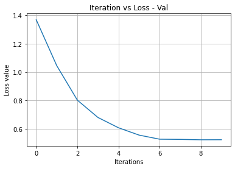

EE4414 Team Practice
==============================================

In this team practice, you will design Convolutional Neural Network(s) to classify food images.


```python
%matplotlib inline
```


```python
from __future__ import print_function, division

import torch
import torch.nn as nn
import torch.optim as optim
from torch.optim import lr_scheduler
import numpy as np
import torchvision
from torchvision import models, transforms
from torchvision.datasets.folder import make_dataset
from PIL import Image
import matplotlib.pyplot as plt
import time
import os
import copy


plt.ion()   # interactive mode
```


    <matplotlib.pyplot._IonContext at 0x7f8d238d8ac0>


## 1. Loading data

Define the dataset, dataloader, and the data augmentation pipeline.

The code below loads 5 classes from all 12 classes in the dataset. You need to modify it to load only the classes that you need.

***Note: For correctly assessing your code, do not change the file structure of the dataset. Use Pytorch data loading utility (`torch.utils.data`) for customizing your dataset.***


```python
# Define the dataset class
class sg_food_dataset(torch.utils.data.dataset.Dataset):
    def __init__(self, root, class_id, transform=None):
        self.class_id = class_id
        self.root = root
        all_classes = sorted(entry.name for entry in os.scandir(root) if entry.is_dir())
        if not all_classes:
            raise FileNotFoundError(f"Couldn't find any class folder in {directory}.")
        self.classes = [all_classes[x] for x in class_id]
        self.class_to_idx = {cls_name: i for i, cls_name in enumerate(self.classes)}

        self.samples = make_dataset(self.root, self.class_to_idx, extensions=('jpg'))
        self.transform = transform

    def __len__(self):
        return len(self.samples)

    def __getitem__(self, idx):
        path, target = self.samples[idx]
        with open(path, "rb") as f:
            sample = Image.open(f).convert('RGB')
        if self.transform is not None:
            sample = self.transform(sample)
        return sample, target

```


```python

# Data augmentation and normalization for training
data_transforms = {
    'train': transforms.Compose([
        # Define data preparation operations for training set here.
        # Tips: Use torchvision.transforms
        #       https://pytorch.org/vision/stable/transforms.html
        #       Normally this should at least contain resizing (Resize) and data format converting (ToTensor).
        transforms.RandomResizedCrop(224),
        transforms.RandomHorizontalFlip(),
        transforms.ToTensor(),
        transforms.Normalize([0.485, 0.456, 0.406], [0.229, 0.224, 0.225]) # ImageNet prior
    ]),
    'val': transforms.Compose([
        # Define data preparation operations for testing/validation set here.
        transforms.Resize(256),
        transforms.CenterCrop(224),
        transforms.ToTensor(),
        transforms.Normalize([0.485, 0.456, 0.406], [0.229, 0.224, 0.225]) # ImageNet prior
    ]),
}

data_dir = os.path.join('./', 'sg_food')
subfolder = {'train': 'train', 'val': 'val'}

# Define the dataset
selected_classes = [3,5,7,8,9]
n_classes = len(selected_classes)
image_datasets = {x: sg_food_dataset(root=os.path.join(data_dir, subfolder[x]),
                                     class_id=selected_classes,
                                     transform=data_transforms[x]) 
                  for x in ['train', 'val']}
class_names = image_datasets['train'].classes
print('selected classes:\n    id: {}\n    name: {}'.format(selected_classes, class_names))

# Define the dataloader
batch_size = 64

time_start = time.time()
dataloaders = {x: torch.utils.data.DataLoader(image_datasets[x], batch_size=batch_size,
                                             shuffle=True, num_workers=0)
              for x in ['train', 'val']}
time_end = time.time()-time_start
print(time_end)

dataset_sizes = {x: len(image_datasets[x]) for x in ['train', 'val']}

device = torch.device("cuda:0" if torch.cuda.is_available() else "cpu")


```

    selected classes:
        id: [3, 5, 7, 8, 9]
        name: ['Hokkien Prawn Mee', 'Laksa', 'Oyster Omelette', 'Roast Meat Rice', 'Roti Prata']
    0.0003001689910888672


## 2. Visualizing the dataset
Fetch a batch of training data from the dataset and visualize them. 


```python
def imshow(inp, title=None):
    """Imshow for Tensor."""
    inp = inp.numpy().transpose((1, 2, 0))
    mean = np.array([0.485, 0.456, 0.406])
    std = np.array([0.229, 0.224, 0.225])
    inp = std * inp + mean
    inp = np.clip(inp, 0, 1)
    plt.imshow(inp)
    if title is not None:
        plt.title(title)
    plt.pause(0.001)  # pause a bit so that plots are updated


# Get a batch of training data
inputs, classes = next(iter(dataloaders['train']))

# Make a grid from batch
out = torchvision.utils.make_grid(inputs[:4])

imshow(out, title=[class_names[x] for x in classes[:4]])
```


    

    


## 3. Defining function to train the model

Use a pre-trained CNN model with transfer learning techniques to classify the 5 food categories.

(Note: The provided code is only for reference. You can modify the code whichever way you want.)


```python
def train_model(model, criterion, optimizer, scheduler, num_epochs=24):
    since = time.time()

    best_model_wts = copy.deepcopy(model.state_dict())
    best_acc = 0.0
    
    loss_list = []
    acc_list = []
    
    loss_list_val = []
    acc_list_val = []
    for epoch in range(num_epochs):
        print('Epoch {}/{}'.format(epoch, num_epochs - 1))
        print('-' * 10)
        t1 = time.time()

        # Each epoch has a training and validation phase
        for phase in ['train', 'val']:
            if phase == 'train':
                model.train()  # Set model to training mode
            else:
                model.eval()   # Set model to evaluate mode

            running_loss = 0.0
            running_corrects = 0

            # Iterate over data.
            for inputs, labels in dataloaders[phase]:
                inputs = inputs.to(device)
                labels = labels.to(device)

                # zero the parameter gradients
                optimizer.zero_grad()

                # forward
                # track history if only in train
                with torch.set_grad_enabled(phase == 'train'):
                    outputs = model(inputs)
                    _, preds = torch.max(outputs, 1)
                    loss = criterion(outputs, labels)

                    # backward + optimize only if in training phase
                    if phase == 'train':
                        loss.backward()
                        optimizer.step()

                # statistics
                running_loss += loss.item() * inputs.size(0)
                running_corrects += torch.sum(preds == labels.data)
                
            if phase == 'train':
                scheduler.step()
            
            
            epoch_loss = running_loss / dataset_sizes[phase]
            epoch_acc = running_corrects.double() / dataset_sizes[phase]
            
            if phase == 'train':
                ## APPEND LOSS AND ACCURACY
                loss_list.append(epoch_loss)
                acc_list.append(epoch_acc)
            else:
                ## APPEND LOSS AND ACCURACY
                loss_list_val.append(epoch_loss)
                acc_list_val.append(epoch_acc)

            print('{} Loss: {:.4f} Acc: {:.4f}'.format(
                phase, epoch_loss, epoch_acc))
            
            
            
            # deep copy the model
            if phase == 'val' and epoch_acc > best_acc:
                best_acc = epoch_acc
                best_model_wts = copy.deepcopy(model.state_dict())

        t2=time.time()
        print('Time:'+str(t2-t1))
        print()
        

    time_elapsed = time.time() - since
    print('Training complete in {:.0f}m {:.0f}s'.format(
        time_elapsed // 60, time_elapsed % 60))
    print('Best val Acc: {:4f}'.format(best_acc))

    # load best model weights
    model.load_state_dict(best_model_wts)
    return model,loss_list,acc_list,loss_list_val,acc_list_val
```

## 3.2 Defining Function to Vsualize Model


```python
def visualize_model(model, num_images=6):
    was_training = model.training
    model.eval()
    images_so_far = 0
    fig = plt.figure()

    with torch.no_grad():
        for i, (inputs, labels) in enumerate(dataloaders['val']):
            inputs = inputs.to(device)
            labels = labels.to(device)

            outputs = model(inputs)
            _, preds = torch.max(outputs, 1)

            for j in range(inputs.size()[0]):
                images_so_far += 1
                ax = plt.subplot(num_images//2, 2, images_so_far)
                ax.axis('off')
                ax.set_title('predicted: {}'.format(class_names[preds[j]]))
                imshow(inputs.cpu().data[j])

                if images_so_far == num_images:
                    model.train(mode=was_training)
                    return
        model.train(mode=was_training)
```


```python

```

## 4. Training and validating the model

Train your model for minimum 3 epochs.

### 4.1 Loading pretrained model and defining new classfier layer


```python
# 1. Load the pretrained model and extract the intermediate features.
# Tips:     Use torchvision.models
#           https://pytorch.org/vision/stable/models.html#classification

# (code)

model = models.efficientnet_b0(pretrained=True)

# 2. Modify the pretrain model for your task.


for param in model.parameters():
    param.requires_grad = False

num_ftrs = model.classifier[-1].in_features
model.classifier[-1] = nn.Linear(num_ftrs, 5)

# # (code)

# # 3. Choose your loss function, optimizer, etc.

criterion = nn.CrossEntropyLoss()

# # Observe that only parameters of final layer are being optimized as
# # opposed to before.
optimizer_conv = optim.SGD(model.classifier.parameters(), lr=0.01, momentum=0.9)
# optimizer_conv = optim.Adam(model.classifier.parameters())

exp_lr_scheduler = lr_scheduler.StepLR(optimizer_conv, step_size=7, gamma=0.1)
# (code)
```

### 4.2 Printing and visualizing the modified model


```python
# TODO
print(model)
```

    EfficientNet(
      (features): Sequential(
        (0): ConvNormActivation(
          (0): Conv2d(3, 32, kernel_size=(3, 3), stride=(2, 2), padding=(1, 1), bias=False)
          (1): BatchNorm2d(32, eps=1e-05, momentum=0.1, affine=True, track_running_stats=True)
          (2): SiLU(inplace=True)
        )
        (1): Sequential(
          (0): MBConv(
            (block): Sequential(
              (0): ConvNormActivation(
                (0): Conv2d(32, 32, kernel_size=(3, 3), stride=(1, 1), padding=(1, 1), groups=32, bias=False)
                (1): BatchNorm2d(32, eps=1e-05, momentum=0.1, affine=True, track_running_stats=True)
                (2): SiLU(inplace=True)
              )
              (1): SqueezeExcitation(
                (avgpool): AdaptiveAvgPool2d(output_size=1)
                (fc1): Conv2d(32, 8, kernel_size=(1, 1), stride=(1, 1))
                (fc2): Conv2d(8, 32, kernel_size=(1, 1), stride=(1, 1))
                (activation): SiLU(inplace=True)
                (scale_activation): Sigmoid()
              )
              (2): ConvNormActivation(
                (0): Conv2d(32, 16, kernel_size=(1, 1), stride=(1, 1), bias=False)
                (1): BatchNorm2d(16, eps=1e-05, momentum=0.1, affine=True, track_running_stats=True)
              )
            )
            (stochastic_depth): StochasticDepth(p=0.0, mode=row)
          )
        )
        (2): Sequential(
          (0): MBConv(
            (block): Sequential(
              (0): ConvNormActivation(
                (0): Conv2d(16, 96, kernel_size=(1, 1), stride=(1, 1), bias=False)
                (1): BatchNorm2d(96, eps=1e-05, momentum=0.1, affine=True, track_running_stats=True)
                (2): SiLU(inplace=True)
              )
              (1): ConvNormActivation(
                (0): Conv2d(96, 96, kernel_size=(3, 3), stride=(2, 2), padding=(1, 1), groups=96, bias=False)
                (1): BatchNorm2d(96, eps=1e-05, momentum=0.1, affine=True, track_running_stats=True)
                (2): SiLU(inplace=True)
              )
              (2): SqueezeExcitation(
                (avgpool): AdaptiveAvgPool2d(output_size=1)
                (fc1): Conv2d(96, 4, kernel_size=(1, 1), stride=(1, 1))
                (fc2): Conv2d(4, 96, kernel_size=(1, 1), stride=(1, 1))
                (activation): SiLU(inplace=True)
                (scale_activation): Sigmoid()
              )
              (3): ConvNormActivation(
                (0): Conv2d(96, 24, kernel_size=(1, 1), stride=(1, 1), bias=False)
                (1): BatchNorm2d(24, eps=1e-05, momentum=0.1, affine=True, track_running_stats=True)
              )
            )
            (stochastic_depth): StochasticDepth(p=0.0125, mode=row)
          )
          (1): MBConv(
            (block): Sequential(
              (0): ConvNormActivation(
                (0): Conv2d(24, 144, kernel_size=(1, 1), stride=(1, 1), bias=False)
                (1): BatchNorm2d(144, eps=1e-05, momentum=0.1, affine=True, track_running_stats=True)
                (2): SiLU(inplace=True)
              )
              (1): ConvNormActivation(
                (0): Conv2d(144, 144, kernel_size=(3, 3), stride=(1, 1), padding=(1, 1), groups=144, bias=False)
                (1): BatchNorm2d(144, eps=1e-05, momentum=0.1, affine=True, track_running_stats=True)
                (2): SiLU(inplace=True)
              )
              (2): SqueezeExcitation(
                (avgpool): AdaptiveAvgPool2d(output_size=1)
                (fc1): Conv2d(144, 6, kernel_size=(1, 1), stride=(1, 1))
                (fc2): Conv2d(6, 144, kernel_size=(1, 1), stride=(1, 1))
                (activation): SiLU(inplace=True)
                (scale_activation): Sigmoid()
              )
              (3): ConvNormActivation(
                (0): Conv2d(144, 24, kernel_size=(1, 1), stride=(1, 1), bias=False)
                (1): BatchNorm2d(24, eps=1e-05, momentum=0.1, affine=True, track_running_stats=True)
              )
            )
            (stochastic_depth): StochasticDepth(p=0.025, mode=row)
          )
        )
        (3): Sequential(
          (0): MBConv(
            (block): Sequential(
              (0): ConvNormActivation(
                (0): Conv2d(24, 144, kernel_size=(1, 1), stride=(1, 1), bias=False)
                (1): BatchNorm2d(144, eps=1e-05, momentum=0.1, affine=True, track_running_stats=True)
                (2): SiLU(inplace=True)
              )
              (1): ConvNormActivation(
                (0): Conv2d(144, 144, kernel_size=(5, 5), stride=(2, 2), padding=(2, 2), groups=144, bias=False)
                (1): BatchNorm2d(144, eps=1e-05, momentum=0.1, affine=True, track_running_stats=True)
                (2): SiLU(inplace=True)
              )
              (2): SqueezeExcitation(
                (avgpool): AdaptiveAvgPool2d(output_size=1)
                (fc1): Conv2d(144, 6, kernel_size=(1, 1), stride=(1, 1))
                (fc2): Conv2d(6, 144, kernel_size=(1, 1), stride=(1, 1))
                (activation): SiLU(inplace=True)
                (scale_activation): Sigmoid()
              )
              (3): ConvNormActivation(
                (0): Conv2d(144, 40, kernel_size=(1, 1), stride=(1, 1), bias=False)
                (1): BatchNorm2d(40, eps=1e-05, momentum=0.1, affine=True, track_running_stats=True)
              )
            )
            (stochastic_depth): StochasticDepth(p=0.037500000000000006, mode=row)
          )
          (1): MBConv(
            (block): Sequential(
              (0): ConvNormActivation(
                (0): Conv2d(40, 240, kernel_size=(1, 1), stride=(1, 1), bias=False)
                (1): BatchNorm2d(240, eps=1e-05, momentum=0.1, affine=True, track_running_stats=True)
                (2): SiLU(inplace=True)
              )
              (1): ConvNormActivation(
                (0): Conv2d(240, 240, kernel_size=(5, 5), stride=(1, 1), padding=(2, 2), groups=240, bias=False)
                (1): BatchNorm2d(240, eps=1e-05, momentum=0.1, affine=True, track_running_stats=True)
                (2): SiLU(inplace=True)
              )
              (2): SqueezeExcitation(
                (avgpool): AdaptiveAvgPool2d(output_size=1)
                (fc1): Conv2d(240, 10, kernel_size=(1, 1), stride=(1, 1))
                (fc2): Conv2d(10, 240, kernel_size=(1, 1), stride=(1, 1))
                (activation): SiLU(inplace=True)
                (scale_activation): Sigmoid()
              )
              (3): ConvNormActivation(
                (0): Conv2d(240, 40, kernel_size=(1, 1), stride=(1, 1), bias=False)
                (1): BatchNorm2d(40, eps=1e-05, momentum=0.1, affine=True, track_running_stats=True)
              )
            )
            (stochastic_depth): StochasticDepth(p=0.05, mode=row)
          )
        )
        (4): Sequential(
          (0): MBConv(
            (block): Sequential(
              (0): ConvNormActivation(
                (0): Conv2d(40, 240, kernel_size=(1, 1), stride=(1, 1), bias=False)
                (1): BatchNorm2d(240, eps=1e-05, momentum=0.1, affine=True, track_running_stats=True)
                (2): SiLU(inplace=True)
              )
              (1): ConvNormActivation(
                (0): Conv2d(240, 240, kernel_size=(3, 3), stride=(2, 2), padding=(1, 1), groups=240, bias=False)
                (1): BatchNorm2d(240, eps=1e-05, momentum=0.1, affine=True, track_running_stats=True)
                (2): SiLU(inplace=True)
              )
              (2): SqueezeExcitation(
                (avgpool): AdaptiveAvgPool2d(output_size=1)
                (fc1): Conv2d(240, 10, kernel_size=(1, 1), stride=(1, 1))
                (fc2): Conv2d(10, 240, kernel_size=(1, 1), stride=(1, 1))
                (activation): SiLU(inplace=True)
                (scale_activation): Sigmoid()
              )
              (3): ConvNormActivation(
                (0): Conv2d(240, 80, kernel_size=(1, 1), stride=(1, 1), bias=False)
                (1): BatchNorm2d(80, eps=1e-05, momentum=0.1, affine=True, track_running_stats=True)
              )
            )
            (stochastic_depth): StochasticDepth(p=0.0625, mode=row)
          )
          (1): MBConv(
            (block): Sequential(
              (0): ConvNormActivation(
                (0): Conv2d(80, 480, kernel_size=(1, 1), stride=(1, 1), bias=False)
                (1): BatchNorm2d(480, eps=1e-05, momentum=0.1, affine=True, track_running_stats=True)
                (2): SiLU(inplace=True)
              )
              (1): ConvNormActivation(
                (0): Conv2d(480, 480, kernel_size=(3, 3), stride=(1, 1), padding=(1, 1), groups=480, bias=False)
                (1): BatchNorm2d(480, eps=1e-05, momentum=0.1, affine=True, track_running_stats=True)
                (2): SiLU(inplace=True)
              )
              (2): SqueezeExcitation(
                (avgpool): AdaptiveAvgPool2d(output_size=1)
                (fc1): Conv2d(480, 20, kernel_size=(1, 1), stride=(1, 1))
                (fc2): Conv2d(20, 480, kernel_size=(1, 1), stride=(1, 1))
                (activation): SiLU(inplace=True)
                (scale_activation): Sigmoid()
              )
              (3): ConvNormActivation(
                (0): Conv2d(480, 80, kernel_size=(1, 1), stride=(1, 1), bias=False)
                (1): BatchNorm2d(80, eps=1e-05, momentum=0.1, affine=True, track_running_stats=True)
              )
            )
            (stochastic_depth): StochasticDepth(p=0.07500000000000001, mode=row)
          )
          (2): MBConv(
            (block): Sequential(
              (0): ConvNormActivation(
                (0): Conv2d(80, 480, kernel_size=(1, 1), stride=(1, 1), bias=False)
                (1): BatchNorm2d(480, eps=1e-05, momentum=0.1, affine=True, track_running_stats=True)
                (2): SiLU(inplace=True)
              )
              (1): ConvNormActivation(
                (0): Conv2d(480, 480, kernel_size=(3, 3), stride=(1, 1), padding=(1, 1), groups=480, bias=False)
                (1): BatchNorm2d(480, eps=1e-05, momentum=0.1, affine=True, track_running_stats=True)
                (2): SiLU(inplace=True)
              )
              (2): SqueezeExcitation(
                (avgpool): AdaptiveAvgPool2d(output_size=1)
                (fc1): Conv2d(480, 20, kernel_size=(1, 1), stride=(1, 1))
                (fc2): Conv2d(20, 480, kernel_size=(1, 1), stride=(1, 1))
                (activation): SiLU(inplace=True)
                (scale_activation): Sigmoid()
              )
              (3): ConvNormActivation(
                (0): Conv2d(480, 80, kernel_size=(1, 1), stride=(1, 1), bias=False)
                (1): BatchNorm2d(80, eps=1e-05, momentum=0.1, affine=True, track_running_stats=True)
              )
            )
            (stochastic_depth): StochasticDepth(p=0.08750000000000001, mode=row)
          )
        )
        (5): Sequential(
          (0): MBConv(
            (block): Sequential(
              (0): ConvNormActivation(
                (0): Conv2d(80, 480, kernel_size=(1, 1), stride=(1, 1), bias=False)
                (1): BatchNorm2d(480, eps=1e-05, momentum=0.1, affine=True, track_running_stats=True)
                (2): SiLU(inplace=True)
              )
              (1): ConvNormActivation(
                (0): Conv2d(480, 480, kernel_size=(5, 5), stride=(1, 1), padding=(2, 2), groups=480, bias=False)
                (1): BatchNorm2d(480, eps=1e-05, momentum=0.1, affine=True, track_running_stats=True)
                (2): SiLU(inplace=True)
              )
              (2): SqueezeExcitation(
                (avgpool): AdaptiveAvgPool2d(output_size=1)
                (fc1): Conv2d(480, 20, kernel_size=(1, 1), stride=(1, 1))
                (fc2): Conv2d(20, 480, kernel_size=(1, 1), stride=(1, 1))
                (activation): SiLU(inplace=True)
                (scale_activation): Sigmoid()
              )
              (3): ConvNormActivation(
                (0): Conv2d(480, 112, kernel_size=(1, 1), stride=(1, 1), bias=False)
                (1): BatchNorm2d(112, eps=1e-05, momentum=0.1, affine=True, track_running_stats=True)
              )
            )
            (stochastic_depth): StochasticDepth(p=0.1, mode=row)
          )
          (1): MBConv(
            (block): Sequential(
              (0): ConvNormActivation(
                (0): Conv2d(112, 672, kernel_size=(1, 1), stride=(1, 1), bias=False)
                (1): BatchNorm2d(672, eps=1e-05, momentum=0.1, affine=True, track_running_stats=True)
                (2): SiLU(inplace=True)
              )
              (1): ConvNormActivation(
                (0): Conv2d(672, 672, kernel_size=(5, 5), stride=(1, 1), padding=(2, 2), groups=672, bias=False)
                (1): BatchNorm2d(672, eps=1e-05, momentum=0.1, affine=True, track_running_stats=True)
                (2): SiLU(inplace=True)
              )
              (2): SqueezeExcitation(
                (avgpool): AdaptiveAvgPool2d(output_size=1)
                (fc1): Conv2d(672, 28, kernel_size=(1, 1), stride=(1, 1))
                (fc2): Conv2d(28, 672, kernel_size=(1, 1), stride=(1, 1))
                (activation): SiLU(inplace=True)
                (scale_activation): Sigmoid()
              )
              (3): ConvNormActivation(
                (0): Conv2d(672, 112, kernel_size=(1, 1), stride=(1, 1), bias=False)
                (1): BatchNorm2d(112, eps=1e-05, momentum=0.1, affine=True, track_running_stats=True)
              )
            )
            (stochastic_depth): StochasticDepth(p=0.1125, mode=row)
          )
          (2): MBConv(
            (block): Sequential(
              (0): ConvNormActivation(
                (0): Conv2d(112, 672, kernel_size=(1, 1), stride=(1, 1), bias=False)
                (1): BatchNorm2d(672, eps=1e-05, momentum=0.1, affine=True, track_running_stats=True)
                (2): SiLU(inplace=True)
              )
              (1): ConvNormActivation(
                (0): Conv2d(672, 672, kernel_size=(5, 5), stride=(1, 1), padding=(2, 2), groups=672, bias=False)
                (1): BatchNorm2d(672, eps=1e-05, momentum=0.1, affine=True, track_running_stats=True)
                (2): SiLU(inplace=True)
              )
              (2): SqueezeExcitation(
                (avgpool): AdaptiveAvgPool2d(output_size=1)
                (fc1): Conv2d(672, 28, kernel_size=(1, 1), stride=(1, 1))
                (fc2): Conv2d(28, 672, kernel_size=(1, 1), stride=(1, 1))
                (activation): SiLU(inplace=True)
                (scale_activation): Sigmoid()
              )
              (3): ConvNormActivation(
                (0): Conv2d(672, 112, kernel_size=(1, 1), stride=(1, 1), bias=False)
                (1): BatchNorm2d(112, eps=1e-05, momentum=0.1, affine=True, track_running_stats=True)
              )
            )
            (stochastic_depth): StochasticDepth(p=0.125, mode=row)
          )
        )
        (6): Sequential(
          (0): MBConv(
            (block): Sequential(
              (0): ConvNormActivation(
                (0): Conv2d(112, 672, kernel_size=(1, 1), stride=(1, 1), bias=False)
                (1): BatchNorm2d(672, eps=1e-05, momentum=0.1, affine=True, track_running_stats=True)
                (2): SiLU(inplace=True)
              )
              (1): ConvNormActivation(
                (0): Conv2d(672, 672, kernel_size=(5, 5), stride=(2, 2), padding=(2, 2), groups=672, bias=False)
                (1): BatchNorm2d(672, eps=1e-05, momentum=0.1, affine=True, track_running_stats=True)
                (2): SiLU(inplace=True)
              )
              (2): SqueezeExcitation(
                (avgpool): AdaptiveAvgPool2d(output_size=1)
                (fc1): Conv2d(672, 28, kernel_size=(1, 1), stride=(1, 1))
                (fc2): Conv2d(28, 672, kernel_size=(1, 1), stride=(1, 1))
                (activation): SiLU(inplace=True)
                (scale_activation): Sigmoid()
              )
              (3): ConvNormActivation(
                (0): Conv2d(672, 192, kernel_size=(1, 1), stride=(1, 1), bias=False)
                (1): BatchNorm2d(192, eps=1e-05, momentum=0.1, affine=True, track_running_stats=True)
              )
            )
            (stochastic_depth): StochasticDepth(p=0.1375, mode=row)
          )
          (1): MBConv(
            (block): Sequential(
              (0): ConvNormActivation(
                (0): Conv2d(192, 1152, kernel_size=(1, 1), stride=(1, 1), bias=False)
                (1): BatchNorm2d(1152, eps=1e-05, momentum=0.1, affine=True, track_running_stats=True)
                (2): SiLU(inplace=True)
              )
              (1): ConvNormActivation(
                (0): Conv2d(1152, 1152, kernel_size=(5, 5), stride=(1, 1), padding=(2, 2), groups=1152, bias=False)
                (1): BatchNorm2d(1152, eps=1e-05, momentum=0.1, affine=True, track_running_stats=True)
                (2): SiLU(inplace=True)
              )
              (2): SqueezeExcitation(
                (avgpool): AdaptiveAvgPool2d(output_size=1)
                (fc1): Conv2d(1152, 48, kernel_size=(1, 1), stride=(1, 1))
                (fc2): Conv2d(48, 1152, kernel_size=(1, 1), stride=(1, 1))
                (activation): SiLU(inplace=True)
                (scale_activation): Sigmoid()
              )
              (3): ConvNormActivation(
                (0): Conv2d(1152, 192, kernel_size=(1, 1), stride=(1, 1), bias=False)
                (1): BatchNorm2d(192, eps=1e-05, momentum=0.1, affine=True, track_running_stats=True)
              )
            )
            (stochastic_depth): StochasticDepth(p=0.15000000000000002, mode=row)
          )
          (2): MBConv(
            (block): Sequential(
              (0): ConvNormActivation(
                (0): Conv2d(192, 1152, kernel_size=(1, 1), stride=(1, 1), bias=False)
                (1): BatchNorm2d(1152, eps=1e-05, momentum=0.1, affine=True, track_running_stats=True)
                (2): SiLU(inplace=True)
              )
              (1): ConvNormActivation(
                (0): Conv2d(1152, 1152, kernel_size=(5, 5), stride=(1, 1), padding=(2, 2), groups=1152, bias=False)
                (1): BatchNorm2d(1152, eps=1e-05, momentum=0.1, affine=True, track_running_stats=True)
                (2): SiLU(inplace=True)
              )
              (2): SqueezeExcitation(
                (avgpool): AdaptiveAvgPool2d(output_size=1)
                (fc1): Conv2d(1152, 48, kernel_size=(1, 1), stride=(1, 1))
                (fc2): Conv2d(48, 1152, kernel_size=(1, 1), stride=(1, 1))
                (activation): SiLU(inplace=True)
                (scale_activation): Sigmoid()
              )
              (3): ConvNormActivation(
                (0): Conv2d(1152, 192, kernel_size=(1, 1), stride=(1, 1), bias=False)
                (1): BatchNorm2d(192, eps=1e-05, momentum=0.1, affine=True, track_running_stats=True)
              )
            )
            (stochastic_depth): StochasticDepth(p=0.1625, mode=row)
          )
          (3): MBConv(
            (block): Sequential(
              (0): ConvNormActivation(
                (0): Conv2d(192, 1152, kernel_size=(1, 1), stride=(1, 1), bias=False)
                (1): BatchNorm2d(1152, eps=1e-05, momentum=0.1, affine=True, track_running_stats=True)
                (2): SiLU(inplace=True)
              )
              (1): ConvNormActivation(
                (0): Conv2d(1152, 1152, kernel_size=(5, 5), stride=(1, 1), padding=(2, 2), groups=1152, bias=False)
                (1): BatchNorm2d(1152, eps=1e-05, momentum=0.1, affine=True, track_running_stats=True)
                (2): SiLU(inplace=True)
              )
              (2): SqueezeExcitation(
                (avgpool): AdaptiveAvgPool2d(output_size=1)
                (fc1): Conv2d(1152, 48, kernel_size=(1, 1), stride=(1, 1))
                (fc2): Conv2d(48, 1152, kernel_size=(1, 1), stride=(1, 1))
                (activation): SiLU(inplace=True)
                (scale_activation): Sigmoid()
              )
              (3): ConvNormActivation(
                (0): Conv2d(1152, 192, kernel_size=(1, 1), stride=(1, 1), bias=False)
                (1): BatchNorm2d(192, eps=1e-05, momentum=0.1, affine=True, track_running_stats=True)
              )
            )
            (stochastic_depth): StochasticDepth(p=0.17500000000000002, mode=row)
          )
        )
        (7): Sequential(
          (0): MBConv(
            (block): Sequential(
              (0): ConvNormActivation(
                (0): Conv2d(192, 1152, kernel_size=(1, 1), stride=(1, 1), bias=False)
                (1): BatchNorm2d(1152, eps=1e-05, momentum=0.1, affine=True, track_running_stats=True)
                (2): SiLU(inplace=True)
              )
              (1): ConvNormActivation(
                (0): Conv2d(1152, 1152, kernel_size=(3, 3), stride=(1, 1), padding=(1, 1), groups=1152, bias=False)
                (1): BatchNorm2d(1152, eps=1e-05, momentum=0.1, affine=True, track_running_stats=True)
                (2): SiLU(inplace=True)
              )
              (2): SqueezeExcitation(
                (avgpool): AdaptiveAvgPool2d(output_size=1)
                (fc1): Conv2d(1152, 48, kernel_size=(1, 1), stride=(1, 1))
                (fc2): Conv2d(48, 1152, kernel_size=(1, 1), stride=(1, 1))
                (activation): SiLU(inplace=True)
                (scale_activation): Sigmoid()
              )
              (3): ConvNormActivation(
                (0): Conv2d(1152, 320, kernel_size=(1, 1), stride=(1, 1), bias=False)
                (1): BatchNorm2d(320, eps=1e-05, momentum=0.1, affine=True, track_running_stats=True)
              )
            )
            (stochastic_depth): StochasticDepth(p=0.1875, mode=row)
          )
        )
        (8): ConvNormActivation(
          (0): Conv2d(320, 1280, kernel_size=(1, 1), stride=(1, 1), bias=False)
          (1): BatchNorm2d(1280, eps=1e-05, momentum=0.1, affine=True, track_running_stats=True)
          (2): SiLU(inplace=True)
        )
      )
      (avgpool): AdaptiveAvgPool2d(output_size=1)
      (classifier): Sequential(
        (0): Dropout(p=0.2, inplace=True)
        (1): Linear(in_features=1280, out_features=5, bias=True)
      )
    )


```python
# TODO
from torchsummary import summary
summary(model, input_size=(3,224,224))
```

    ----------------------------------------------------------------
            Layer (type)               Output Shape         Param #
    ================================================================
                Conv2d-1         [-1, 32, 112, 112]             864
           BatchNorm2d-2         [-1, 32, 112, 112]              64
                  SiLU-3         [-1, 32, 112, 112]               0
                Conv2d-4         [-1, 32, 112, 112]             288
           BatchNorm2d-5         [-1, 32, 112, 112]              64
                  SiLU-6         [-1, 32, 112, 112]               0
     AdaptiveAvgPool2d-7             [-1, 32, 1, 1]               0
                Conv2d-8              [-1, 8, 1, 1]             264
                  SiLU-9              [-1, 8, 1, 1]               0
               Conv2d-10             [-1, 32, 1, 1]             288
              Sigmoid-11             [-1, 32, 1, 1]               0
    SqueezeExcitation-12         [-1, 32, 112, 112]               0
               Conv2d-13         [-1, 16, 112, 112]             512
          BatchNorm2d-14         [-1, 16, 112, 112]              32
               MBConv-15         [-1, 16, 112, 112]               0
               Conv2d-16         [-1, 96, 112, 112]           1,536
          BatchNorm2d-17         [-1, 96, 112, 112]             192
                 SiLU-18         [-1, 96, 112, 112]               0
               Conv2d-19           [-1, 96, 56, 56]             864
          BatchNorm2d-20           [-1, 96, 56, 56]             192
                 SiLU-21           [-1, 96, 56, 56]               0
    AdaptiveAvgPool2d-22             [-1, 96, 1, 1]               0
               Conv2d-23              [-1, 4, 1, 1]             388
                 SiLU-24              [-1, 4, 1, 1]               0
               Conv2d-25             [-1, 96, 1, 1]             480
              Sigmoid-26             [-1, 96, 1, 1]               0
    SqueezeExcitation-27           [-1, 96, 56, 56]               0
               Conv2d-28           [-1, 24, 56, 56]           2,304
          BatchNorm2d-29           [-1, 24, 56, 56]              48
               MBConv-30           [-1, 24, 56, 56]               0
               Conv2d-31          [-1, 144, 56, 56]           3,456
          BatchNorm2d-32          [-1, 144, 56, 56]             288
                 SiLU-33          [-1, 144, 56, 56]               0
               Conv2d-34          [-1, 144, 56, 56]           1,296
          BatchNorm2d-35          [-1, 144, 56, 56]             288
                 SiLU-36          [-1, 144, 56, 56]               0
    AdaptiveAvgPool2d-37            [-1, 144, 1, 1]               0
               Conv2d-38              [-1, 6, 1, 1]             870
                 SiLU-39              [-1, 6, 1, 1]               0
               Conv2d-40            [-1, 144, 1, 1]           1,008
              Sigmoid-41            [-1, 144, 1, 1]               0
    SqueezeExcitation-42          [-1, 144, 56, 56]               0
               Conv2d-43           [-1, 24, 56, 56]           3,456
          BatchNorm2d-44           [-1, 24, 56, 56]              48
      StochasticDepth-45           [-1, 24, 56, 56]               0
               MBConv-46           [-1, 24, 56, 56]               0
               Conv2d-47          [-1, 144, 56, 56]           3,456
          BatchNorm2d-48          [-1, 144, 56, 56]             288
                 SiLU-49          [-1, 144, 56, 56]               0
               Conv2d-50          [-1, 144, 28, 28]           3,600
          BatchNorm2d-51          [-1, 144, 28, 28]             288
                 SiLU-52          [-1, 144, 28, 28]               0
    AdaptiveAvgPool2d-53            [-1, 144, 1, 1]               0
               Conv2d-54              [-1, 6, 1, 1]             870
                 SiLU-55              [-1, 6, 1, 1]               0
               Conv2d-56            [-1, 144, 1, 1]           1,008
              Sigmoid-57            [-1, 144, 1, 1]               0
    SqueezeExcitation-58          [-1, 144, 28, 28]               0
               Conv2d-59           [-1, 40, 28, 28]           5,760
          BatchNorm2d-60           [-1, 40, 28, 28]              80
               MBConv-61           [-1, 40, 28, 28]               0
               Conv2d-62          [-1, 240, 28, 28]           9,600
          BatchNorm2d-63          [-1, 240, 28, 28]             480
                 SiLU-64          [-1, 240, 28, 28]               0
               Conv2d-65          [-1, 240, 28, 28]           6,000
          BatchNorm2d-66          [-1, 240, 28, 28]             480
                 SiLU-67          [-1, 240, 28, 28]               0
    AdaptiveAvgPool2d-68            [-1, 240, 1, 1]               0
               Conv2d-69             [-1, 10, 1, 1]           2,410
                 SiLU-70             [-1, 10, 1, 1]               0
               Conv2d-71            [-1, 240, 1, 1]           2,640
              Sigmoid-72            [-1, 240, 1, 1]               0
    SqueezeExcitation-73          [-1, 240, 28, 28]               0
               Conv2d-74           [-1, 40, 28, 28]           9,600
          BatchNorm2d-75           [-1, 40, 28, 28]              80
      StochasticDepth-76           [-1, 40, 28, 28]               0
               MBConv-77           [-1, 40, 28, 28]               0
               Conv2d-78          [-1, 240, 28, 28]           9,600
          BatchNorm2d-79          [-1, 240, 28, 28]             480
                 SiLU-80          [-1, 240, 28, 28]               0
               Conv2d-81          [-1, 240, 14, 14]           2,160
          BatchNorm2d-82          [-1, 240, 14, 14]             480
                 SiLU-83          [-1, 240, 14, 14]               0
    AdaptiveAvgPool2d-84            [-1, 240, 1, 1]               0
               Conv2d-85             [-1, 10, 1, 1]           2,410
                 SiLU-86             [-1, 10, 1, 1]               0
               Conv2d-87            [-1, 240, 1, 1]           2,640
              Sigmoid-88            [-1, 240, 1, 1]               0
    SqueezeExcitation-89          [-1, 240, 14, 14]               0
               Conv2d-90           [-1, 80, 14, 14]          19,200
          BatchNorm2d-91           [-1, 80, 14, 14]             160
               MBConv-92           [-1, 80, 14, 14]               0
               Conv2d-93          [-1, 480, 14, 14]          38,400
          BatchNorm2d-94          [-1, 480, 14, 14]             960
                 SiLU-95          [-1, 480, 14, 14]               0
               Conv2d-96          [-1, 480, 14, 14]           4,320
          BatchNorm2d-97          [-1, 480, 14, 14]             960
                 SiLU-98          [-1, 480, 14, 14]               0
    AdaptiveAvgPool2d-99            [-1, 480, 1, 1]               0
              Conv2d-100             [-1, 20, 1, 1]           9,620
                SiLU-101             [-1, 20, 1, 1]               0
              Conv2d-102            [-1, 480, 1, 1]          10,080
             Sigmoid-103            [-1, 480, 1, 1]               0
    SqueezeExcitation-104          [-1, 480, 14, 14]               0
              Conv2d-105           [-1, 80, 14, 14]          38,400
         BatchNorm2d-106           [-1, 80, 14, 14]             160
     StochasticDepth-107           [-1, 80, 14, 14]               0
              MBConv-108           [-1, 80, 14, 14]               0
              Conv2d-109          [-1, 480, 14, 14]          38,400
         BatchNorm2d-110          [-1, 480, 14, 14]             960
                SiLU-111          [-1, 480, 14, 14]               0
              Conv2d-112          [-1, 480, 14, 14]           4,320
         BatchNorm2d-113          [-1, 480, 14, 14]             960
                SiLU-114          [-1, 480, 14, 14]               0
    AdaptiveAvgPool2d-115            [-1, 480, 1, 1]               0
              Conv2d-116             [-1, 20, 1, 1]           9,620
                SiLU-117             [-1, 20, 1, 1]               0
              Conv2d-118            [-1, 480, 1, 1]          10,080
             Sigmoid-119            [-1, 480, 1, 1]               0
    SqueezeExcitation-120          [-1, 480, 14, 14]               0
              Conv2d-121           [-1, 80, 14, 14]          38,400
         BatchNorm2d-122           [-1, 80, 14, 14]             160
     StochasticDepth-123           [-1, 80, 14, 14]               0
              MBConv-124           [-1, 80, 14, 14]               0
              Conv2d-125          [-1, 480, 14, 14]          38,400
         BatchNorm2d-126          [-1, 480, 14, 14]             960
                SiLU-127          [-1, 480, 14, 14]               0
              Conv2d-128          [-1, 480, 14, 14]          12,000
         BatchNorm2d-129          [-1, 480, 14, 14]             960
                SiLU-130          [-1, 480, 14, 14]               0
    AdaptiveAvgPool2d-131            [-1, 480, 1, 1]               0
              Conv2d-132             [-1, 20, 1, 1]           9,620
                SiLU-133             [-1, 20, 1, 1]               0
              Conv2d-134            [-1, 480, 1, 1]          10,080
             Sigmoid-135            [-1, 480, 1, 1]               0
    SqueezeExcitation-136          [-1, 480, 14, 14]               0
              Conv2d-137          [-1, 112, 14, 14]          53,760
         BatchNorm2d-138          [-1, 112, 14, 14]             224
              MBConv-139          [-1, 112, 14, 14]               0
              Conv2d-140          [-1, 672, 14, 14]          75,264
         BatchNorm2d-141          [-1, 672, 14, 14]           1,344
                SiLU-142          [-1, 672, 14, 14]               0
              Conv2d-143          [-1, 672, 14, 14]          16,800
         BatchNorm2d-144          [-1, 672, 14, 14]           1,344
                SiLU-145          [-1, 672, 14, 14]               0
    AdaptiveAvgPool2d-146            [-1, 672, 1, 1]               0
              Conv2d-147             [-1, 28, 1, 1]          18,844
                SiLU-148             [-1, 28, 1, 1]               0
              Conv2d-149            [-1, 672, 1, 1]          19,488
             Sigmoid-150            [-1, 672, 1, 1]               0
    SqueezeExcitation-151          [-1, 672, 14, 14]               0
              Conv2d-152          [-1, 112, 14, 14]          75,264
         BatchNorm2d-153          [-1, 112, 14, 14]             224
     StochasticDepth-154          [-1, 112, 14, 14]               0
              MBConv-155          [-1, 112, 14, 14]               0
              Conv2d-156          [-1, 672, 14, 14]          75,264
         BatchNorm2d-157          [-1, 672, 14, 14]           1,344
                SiLU-158          [-1, 672, 14, 14]               0
              Conv2d-159          [-1, 672, 14, 14]          16,800
         BatchNorm2d-160          [-1, 672, 14, 14]           1,344
                SiLU-161          [-1, 672, 14, 14]               0
    AdaptiveAvgPool2d-162            [-1, 672, 1, 1]               0
              Conv2d-163             [-1, 28, 1, 1]          18,844
                SiLU-164             [-1, 28, 1, 1]               0
              Conv2d-165            [-1, 672, 1, 1]          19,488
             Sigmoid-166            [-1, 672, 1, 1]               0
    SqueezeExcitation-167          [-1, 672, 14, 14]               0
              Conv2d-168          [-1, 112, 14, 14]          75,264
         BatchNorm2d-169          [-1, 112, 14, 14]             224
     StochasticDepth-170          [-1, 112, 14, 14]               0
              MBConv-171          [-1, 112, 14, 14]               0
              Conv2d-172          [-1, 672, 14, 14]          75,264
         BatchNorm2d-173          [-1, 672, 14, 14]           1,344
                SiLU-174          [-1, 672, 14, 14]               0
              Conv2d-175            [-1, 672, 7, 7]          16,800
         BatchNorm2d-176            [-1, 672, 7, 7]           1,344
                SiLU-177            [-1, 672, 7, 7]               0
    AdaptiveAvgPool2d-178            [-1, 672, 1, 1]               0
              Conv2d-179             [-1, 28, 1, 1]          18,844
                SiLU-180             [-1, 28, 1, 1]               0
              Conv2d-181            [-1, 672, 1, 1]          19,488
             Sigmoid-182            [-1, 672, 1, 1]               0
    SqueezeExcitation-183            [-1, 672, 7, 7]               0
              Conv2d-184            [-1, 192, 7, 7]         129,024
         BatchNorm2d-185            [-1, 192, 7, 7]             384
              MBConv-186            [-1, 192, 7, 7]               0
              Conv2d-187           [-1, 1152, 7, 7]         221,184
         BatchNorm2d-188           [-1, 1152, 7, 7]           2,304
                SiLU-189           [-1, 1152, 7, 7]               0
              Conv2d-190           [-1, 1152, 7, 7]          28,800
         BatchNorm2d-191           [-1, 1152, 7, 7]           2,304
                SiLU-192           [-1, 1152, 7, 7]               0
    AdaptiveAvgPool2d-193           [-1, 1152, 1, 1]               0
              Conv2d-194             [-1, 48, 1, 1]          55,344
                SiLU-195             [-1, 48, 1, 1]               0
              Conv2d-196           [-1, 1152, 1, 1]          56,448
             Sigmoid-197           [-1, 1152, 1, 1]               0
    SqueezeExcitation-198           [-1, 1152, 7, 7]               0
              Conv2d-199            [-1, 192, 7, 7]         221,184
         BatchNorm2d-200            [-1, 192, 7, 7]             384
     StochasticDepth-201            [-1, 192, 7, 7]               0
              MBConv-202            [-1, 192, 7, 7]               0
              Conv2d-203           [-1, 1152, 7, 7]         221,184
         BatchNorm2d-204           [-1, 1152, 7, 7]           2,304
                SiLU-205           [-1, 1152, 7, 7]               0
              Conv2d-206           [-1, 1152, 7, 7]          28,800
         BatchNorm2d-207           [-1, 1152, 7, 7]           2,304
                SiLU-208           [-1, 1152, 7, 7]               0
    AdaptiveAvgPool2d-209           [-1, 1152, 1, 1]               0
              Conv2d-210             [-1, 48, 1, 1]          55,344
                SiLU-211             [-1, 48, 1, 1]               0
              Conv2d-212           [-1, 1152, 1, 1]          56,448
             Sigmoid-213           [-1, 1152, 1, 1]               0
    SqueezeExcitation-214           [-1, 1152, 7, 7]               0
              Conv2d-215            [-1, 192, 7, 7]         221,184
         BatchNorm2d-216            [-1, 192, 7, 7]             384
     StochasticDepth-217            [-1, 192, 7, 7]               0
              MBConv-218            [-1, 192, 7, 7]               0
              Conv2d-219           [-1, 1152, 7, 7]         221,184
         BatchNorm2d-220           [-1, 1152, 7, 7]           2,304
                SiLU-221           [-1, 1152, 7, 7]               0
              Conv2d-222           [-1, 1152, 7, 7]          28,800
         BatchNorm2d-223           [-1, 1152, 7, 7]           2,304
                SiLU-224           [-1, 1152, 7, 7]               0
    AdaptiveAvgPool2d-225           [-1, 1152, 1, 1]               0
              Conv2d-226             [-1, 48, 1, 1]          55,344
                SiLU-227             [-1, 48, 1, 1]               0
              Conv2d-228           [-1, 1152, 1, 1]          56,448
             Sigmoid-229           [-1, 1152, 1, 1]               0
    SqueezeExcitation-230           [-1, 1152, 7, 7]               0
              Conv2d-231            [-1, 192, 7, 7]         221,184
         BatchNorm2d-232            [-1, 192, 7, 7]             384
     StochasticDepth-233            [-1, 192, 7, 7]               0
              MBConv-234            [-1, 192, 7, 7]               0
              Conv2d-235           [-1, 1152, 7, 7]         221,184
         BatchNorm2d-236           [-1, 1152, 7, 7]           2,304
                SiLU-237           [-1, 1152, 7, 7]               0
              Conv2d-238           [-1, 1152, 7, 7]          10,368
         BatchNorm2d-239           [-1, 1152, 7, 7]           2,304
                SiLU-240           [-1, 1152, 7, 7]               0
    AdaptiveAvgPool2d-241           [-1, 1152, 1, 1]               0
              Conv2d-242             [-1, 48, 1, 1]          55,344
                SiLU-243             [-1, 48, 1, 1]               0
              Conv2d-244           [-1, 1152, 1, 1]          56,448
             Sigmoid-245           [-1, 1152, 1, 1]               0
    SqueezeExcitation-246           [-1, 1152, 7, 7]               0
              Conv2d-247            [-1, 320, 7, 7]         368,640
         BatchNorm2d-248            [-1, 320, 7, 7]             640
              MBConv-249            [-1, 320, 7, 7]               0
              Conv2d-250           [-1, 1280, 7, 7]         409,600
         BatchNorm2d-251           [-1, 1280, 7, 7]           2,560
                SiLU-252           [-1, 1280, 7, 7]               0
    AdaptiveAvgPool2d-253           [-1, 1280, 1, 1]               0
             Dropout-254                 [-1, 1280]               0
              Linear-255                    [-1, 5]           6,405
    ================================================================
    Total params: 4,013,953
    Trainable params: 6,405
    Non-trainable params: 4,007,548
    ----------------------------------------------------------------
    Input size (MB): 0.57
    Forward/backward pass size (MB): 173.64
    Params size (MB): 15.31
    Estimated Total Size (MB): 189.53
    ----------------------------------------------------------------


### 4.3 Training using train data and evaluating using validation data

Train your model for minimum 3 epochs.


```python
# TODO 
model, loss_list, acc_list,loss_list_val,acc_list_val = train_model(model, criterion, optimizer_conv,
                         exp_lr_scheduler, num_epochs=10)
```

    Epoch 0/9
    ----------
    train Loss: 1.5453 Acc: 0.3160
    val Loss: 1.3687 Acc: 0.5933
    Time:22.598695755004883
    
    Epoch 1/9
    ----------
    train Loss: 1.2723 Acc: 0.6320
    val Loss: 1.0450 Acc: 0.7933
    Time:23.707237243652344
    
    Epoch 2/9
    ----------
    train Loss: 0.9859 Acc: 0.7300
    val Loss: 0.8033 Acc: 0.8267
    Time:25.061400890350342
    
    Epoch 3/9
    ----------
    train Loss: 0.8481 Acc: 0.7700
    val Loss: 0.6817 Acc: 0.8400
    Time:23.607413291931152
    
    Epoch 4/9
    ----------
    train Loss: 0.7486 Acc: 0.7980
    val Loss: 0.6092 Acc: 0.8467
    Time:22.912601470947266
    
    Epoch 5/9
    ----------
    train Loss: 0.6824 Acc: 0.8120
    val Loss: 0.5577 Acc: 0.8600
    Time:22.927902698516846
    
    Epoch 6/9
    ----------
    train Loss: 0.6674 Acc: 0.7800
    val Loss: 0.5290 Acc: 0.8667
    Time:23.147005319595337
    
    Epoch 7/9
    ----------
    train Loss: 0.6180 Acc: 0.8120
    val Loss: 0.5277 Acc: 0.8667
    Time:23.824156999588013
    
    Epoch 8/9
    ----------
    train Loss: 0.6112 Acc: 0.8060
    val Loss: 0.5251 Acc: 0.8667
    Time:23.026482343673706
    
    Epoch 9/9
    ----------
    train Loss: 0.5971 Acc: 0.8280
    val Loss: 0.5254 Acc: 0.8600
    Time:22.850818634033203
    
    Training complete in 3m 54s
    Best val Acc: 0.866667


## 5. Loading test data

Define the dataset and dataloader for testing.


```python
test_dir = os.path.join('./', 'sg_food', 'test')

# Define the test set.
test_dataset = sg_food_dataset(root=test_dir, class_id=selected_classes, transform=data_transforms['val'])
test_sizes = len(test_dataset)

# Define the dataloader for testing.
test_batch_size = 64
test_loader = torch.utils.data.DataLoader(test_dataset, batch_size=test_batch_size, shuffle=True, num_workers=0)
```

## 6. Visualizing the predictions

Predict the label on a few testing samples and visualize the results.


```python
# TODO

# num_images = 4

# (code)

# with torch.no_grad():
    # Predict on the test set

    # (code)

    # Print the output images and labels
    
    # (code)

visualize_model(model)

plt.ioff()
plt.show()

```


    

    


    

    


    

    


    

    


    

    


    

    


## 7. Evaluating on test set

Evaluate your model on the whole test set and compute the accuracy.


```python


model.eval()

test_acc = 0

print('Evaluation')
print('-' * 10)

y_true = []
y_pred = []

wrong_detections = []
correct_detections = []

time_now= time.time()

with torch.no_grad():
    # Iterate over the testing dataset.
    for (inputs, labels) in test_loader:
        inputs = inputs.to(device)
        # Predict on the test set
        outputs = model(inputs)
        _, preds = torch.max(outputs, 1)
        preds = preds.cpu()
        
        # Confusion Matrix
        
        y_true.extend(preds.numpy())
        y_pred.extend(labels.data.numpy())
        
        test_acc += torch.sum(preds == labels.data)

print('Eval time...')
print(time.time()-time_now)
# Compute the testing accuracy
test_acc = test_acc.double() / test_sizes
print('Testing Acc: {:.4f}'.format(test_acc))

```

    Evaluation
    ----------
    Eval time...
    27.7112078666687
    Testing Acc: 0.8328


# Graphing Metrics

### Plotting Loss vs Iteration - Train


```python
iterations = []

for i,loss in enumerate(loss_list):
    iterations.append(i)
```


```python
iterations
```


    [0, 1, 2, 3, 4, 5, 6, 7, 8, 9]


```python
fig, ax = plt.subplots()
ax.plot(iterations, loss_list)

ax.set(xlabel='Iterations', ylabel='Loss value',
       title='Iteration vs Loss Train')
ax.grid()

plt.show()
```


    

    


### Plotting Loss vs Iteration - Val


```python
iterations = []

for i,loss in enumerate(loss_list_val):
    iterations.append(i)
```


```python
fig, ax = plt.subplots()
ax.plot(iterations, loss_list_val)

ax.set(xlabel='Iterations', ylabel='Loss value',
       title='Iteration vs Loss - Val')
ax.grid()

plt.show()
```


    

    


### Plotting Accuracy vs Iteration - Train


```python
iterations = []

for i,loss in enumerate(acc_list):
    iterations.append(i)
```


```python
fig, ax = plt.subplots()
ax.plot(iterations, acc_list)

ax.set(xlabel='Iterations', ylabel='Accuracy value',
       title='Iteration vs Accuracy - Train')
ax.grid()

plt.show()
```


    

    


### Plotting Accuracy vs Iteration - Val


```python
iterations = []

for i,loss in enumerate(acc_list_val):
    iterations.append(i)
```


```python
fig, ax = plt.subplots()
ax.plot(iterations, acc_list_val)

ax.set(xlabel='Iterations', ylabel='Accuracy value',
       title='Iteration vs Accuracy - Val')
ax.grid()

plt.show()
```


    

    


### Generating Confusion Matrix


```python
from sklearn.metrics import confusion_matrix
import seaborn as sn
import pandas as pd
```


```python
len(y_pred)
```


    999


```python
cf_matrix = confusion_matrix(y_true, y_pred)
```


```python

```


```python
# constant for classes
# classes = ()

# Build confusion matrix
cf_matrix = confusion_matrix(y_true, y_pred)
df_cm = pd.DataFrame(cf_matrix, index = [i for i in class_names],
                     columns = [i for i in class_names])
plt.figure(figsize = (12,7))
sn.heatmap(df_cm,fmt='', annot=True)
plt.savefig('effnetb0_lr0.01_exp2_output.png')
```


    

    


### Prediction Examples


```python
predictions = pd.DataFrame({'Actual':y_true,'Predicted':y_pred})
```


```python
predictions.head()
```


<div>
<style scoped>
    .dataframe tbody tr th:only-of-type {
        vertical-align: middle;
    }

    .dataframe tbody tr th {
        vertical-align: top;
    }

    .dataframe thead th {
        text-align: right;
    }
</style>
<table border="1" class="dataframe">
  <thead>
    <tr style="text-align: right;">
      <th></th>
      <th>Actual</th>
      <th>Predicted</th>
    </tr>
  </thead>
  <tbody>
    <tr>
      <th>0</th>
      <td>4</td>
      <td>1</td>
    </tr>
    <tr>
      <th>1</th>
      <td>2</td>
      <td>2</td>
    </tr>
    <tr>
      <th>2</th>
      <td>1</td>
      <td>3</td>
    </tr>
    <tr>
      <th>3</th>
      <td>0</td>
      <td>0</td>
    </tr>
    <tr>
      <th>4</th>
      <td>2</td>
      <td>2</td>
    </tr>
  </tbody>
</table>
</div>


```python
torchvision.__version__
```


    '0.12.0+cu102'


```python

```


```python

```


```python

```
