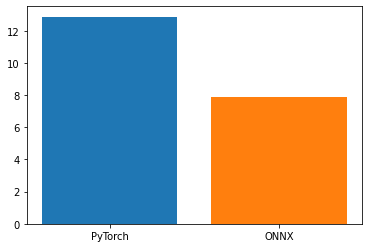

# Torch to ONNX Conversion for Inference Optimization

ONNX Runtime is a performance-focused engine for ONNX models, which inferences efficiently across multiple platforms and hardware (Windows, Linux, and Mac and on both CPUs and GPUs). ONNX Runtime has proved to considerably increase performance over multiple models.

## Standard Imports


```python
# Some standard imports
import io
import numpy as np

from torch import nn
import torch.utils.model_zoo as model_zoo
import torch.onnx

import torch
import torch.nn as nn
import torch.optim as optim
from torch.optim import lr_scheduler
import numpy as np
import torchvision
from torchvision import models, transforms
from torchvision.datasets.folder import make_dataset
from PIL import Image
import matplotlib.pyplot as plt
import time
import os
import copy
```


```python
import onnxruntime
import onnx
```

## Data and Model Preparation


```python
WEIGHT_PATH = './custom_model.pth'
```


```python
# Initialize model with the pretrained weights
model = models.vgg16(pretrained=True)
for param in model.parameters():
    param.requires_grad = False

num_ftrs = model.classifier[-1].in_features
model.classifier[-1] = nn.Linear(num_ftrs, 5)


# Load model weights
model.load_state_dict(torch.load(WEIGHT_PATH,map_location=torch.device('cpu')))

if torch.cuda.is_available():
    model.cuda()

model.eval()
```


    VGG(
      (features): Sequential(
        (0): Conv2d(3, 64, kernel_size=(3, 3), stride=(1, 1), padding=(1, 1))
        (1): ReLU(inplace=True)
        (2): Conv2d(64, 64, kernel_size=(3, 3), stride=(1, 1), padding=(1, 1))
        (3): ReLU(inplace=True)
        (4): MaxPool2d(kernel_size=2, stride=2, padding=0, dilation=1, ceil_mode=False)
        (5): Conv2d(64, 128, kernel_size=(3, 3), stride=(1, 1), padding=(1, 1))
        (6): ReLU(inplace=True)
        (7): Conv2d(128, 128, kernel_size=(3, 3), stride=(1, 1), padding=(1, 1))
        (8): ReLU(inplace=True)
        (9): MaxPool2d(kernel_size=2, stride=2, padding=0, dilation=1, ceil_mode=False)
        (10): Conv2d(128, 256, kernel_size=(3, 3), stride=(1, 1), padding=(1, 1))
        (11): ReLU(inplace=True)
        (12): Conv2d(256, 256, kernel_size=(3, 3), stride=(1, 1), padding=(1, 1))
        (13): ReLU(inplace=True)
        (14): Conv2d(256, 256, kernel_size=(3, 3), stride=(1, 1), padding=(1, 1))
        (15): ReLU(inplace=True)
        (16): MaxPool2d(kernel_size=2, stride=2, padding=0, dilation=1, ceil_mode=False)
        (17): Conv2d(256, 512, kernel_size=(3, 3), stride=(1, 1), padding=(1, 1))
        (18): ReLU(inplace=True)
        (19): Conv2d(512, 512, kernel_size=(3, 3), stride=(1, 1), padding=(1, 1))
        (20): ReLU(inplace=True)
        (21): Conv2d(512, 512, kernel_size=(3, 3), stride=(1, 1), padding=(1, 1))
        (22): ReLU(inplace=True)
        (23): MaxPool2d(kernel_size=2, stride=2, padding=0, dilation=1, ceil_mode=False)
        (24): Conv2d(512, 512, kernel_size=(3, 3), stride=(1, 1), padding=(1, 1))
        (25): ReLU(inplace=True)
        (26): Conv2d(512, 512, kernel_size=(3, 3), stride=(1, 1), padding=(1, 1))
        (27): ReLU(inplace=True)
        (28): Conv2d(512, 512, kernel_size=(3, 3), stride=(1, 1), padding=(1, 1))
        (29): ReLU(inplace=True)
        (30): MaxPool2d(kernel_size=2, stride=2, padding=0, dilation=1, ceil_mode=False)
      )
      (avgpool): AdaptiveAvgPool2d(output_size=(7, 7))
      (classifier): Sequential(
        (0): Linear(in_features=25088, out_features=4096, bias=True)
        (1): ReLU(inplace=True)
        (2): Dropout(p=0.5, inplace=False)
        (3): Linear(in_features=4096, out_features=4096, bias=True)
        (4): ReLU(inplace=True)
        (5): Dropout(p=0.5, inplace=False)
        (6): Linear(in_features=4096, out_features=5, bias=True)
      )
    )


```python
# Define the dataloader for testing.
test_batch_size = 64
# test_loader = torch.utils.data.DataLoader(test_dataset, batch_size=test_batch_size, shuffle=True, num_workers=4,pin_memory=True)
```


```python
# Input to the model
x = torch.randn(test_batch_size, 3, 224, 224, requires_grad=True)
torch_out = model(x)
```

# ONNX Export testing


```python

```


```python
import onnx

onnx_model = onnx.load("./onnx_converted.onnx")
onnx.checker.check_model(onnx_model)
```


```python
import onnxruntime

ort_session = onnxruntime.InferenceSession("./onnx_converted.onnx")
```


```python
# Define the dataset class
class sg_food_dataset(torch.utils.data.dataset.Dataset):
    def __init__(self, root, class_id, transform=None):
        self.class_id = class_id
        self.root = root
        all_classes = sorted(entry.name for entry in os.scandir(root) if entry.is_dir())
        if not all_classes:
            raise FileNotFoundError(f"Couldn't find any class folder in {directory}.")
        self.classes = [all_classes[x] for x in class_id]
        self.class_to_idx = {cls_name: i for i, cls_name in enumerate(self.classes)}

        self.samples = make_dataset(self.root, self.class_to_idx, extensions=('jpg'))
        self.transform = transform

    def __len__(self):
        return len(self.samples)

    def __getitem__(self, idx):
        path, target = self.samples[idx]
        with open(path, "rb") as f:
            sample = Image.open(f).convert('RGB')
        if self.transform is not None:
            sample = self.transform(sample)
        return sample, target

```


```python
def to_numpy(tensor):
    return tensor.detach().cpu().numpy() if tensor.requires_grad else tensor.cpu().numpy()
```


```python

# Data augmentation and normalization for training
data_transforms = {
    'train': transforms.Compose([
        # Define data preparation operations for training set here.
        # Tips: Use torchvision.transforms
        #       https://pytorch.org/vision/stable/transforms.html
        #       Normally this should at least contain resizing (Resize) and data format converting (ToTensor).
        transforms.RandomResizedCrop(224),
        transforms.RandomHorizontalFlip(),
        transforms.ToTensor(),
        transforms.Normalize([0.485, 0.456, 0.406], [0.229, 0.224, 0.225]) # ImageNet prior
    ]),
    'val': transforms.Compose([
        # Define data preparation operations for testing/validation set here.
        transforms.Resize(256),
        transforms.CenterCrop(224),
        transforms.ToTensor(),
        transforms.Normalize([0.485, 0.456, 0.406], [0.229, 0.224, 0.225]) # ImageNet prior
    ]),
}

data_dir = os.path.join('./', 'sg_food')
subfolder = {'train': 'train', 'val': 'val'}

# Define the dataset
selected_classes = [3,5,7,8,9]
n_classes = len(selected_classes)
image_datasets = {x: sg_food_dataset(root=os.path.join(data_dir, subfolder[x]),
                                     class_id=selected_classes,
                                     transform=data_transforms[x]) 
                  for x in ['train', 'val']}
class_names = image_datasets['train'].classes
print('selected classes:\n    id: {}\n    name: {}'.format(selected_classes, class_names))

dataset_sizes = {x: len(image_datasets[x]) for x in ['train', 'val']}

device = torch.device("cuda:0" if torch.cuda.is_available() else "cpu")
```

    selected classes:
        id: [3, 5, 7, 8, 9]
        name: ['Hokkien Prawn Mee', 'Laksa', 'Oyster Omelette', 'Roast Meat Rice', 'Roti Prata']


```python
test_dir = './sg_food/test'

# Define the test set.
test_dataset = sg_food_dataset(root=test_dir, class_id=selected_classes, transform=data_transforms['val'])
test_sizes = len(test_dataset)

# Define the dataloader for testing.
test_batch_size = 64
test_loader = torch.utils.data.DataLoader(test_dataset, batch_size=test_batch_size, shuffle=True, num_workers=0)
```


```python
test_acc = 0

print('Evaluation')
print('-' * 10)

y_true = []
y_pred = []

wrong_detections = []
correct_detections = []

time_total= 0

with torch.no_grad():
    # Iterate over the testing dataset.
    for (inputs, labels) in test_loader:
        inputs = inputs.to(device)
        ort_inputs = {ort_session.get_inputs()[0].name: to_numpy(inputs)}
        time_start = time.time()
        ort_outs = ort_session.run(None, ort_inputs)
        time_total += time.time() - time_start
#         print(type(ort_outs))
#         print(len(ort_outs[0]))
        
        # Predict on the test set
        # outputs = model(inputs)
        output_tensors = torch.FloatTensor(ort_outs[0])
        _, preds = torch.max(output_tensors, 1)
#         print(preds)
        # preds = ort_outs
        
        # Confusion Matrix
        
        y_true.extend(preds.numpy())
        y_pred.extend(labels.data.numpy())
        
        test_acc += torch.sum(preds == labels.data)

print('Eval time...')
print(time_total)
# Compute the testing accuracy
test_acc = test_acc.double() / test_sizes
print('Testing Acc: {:.4f}'.format(test_acc))
```

    Evaluation
    ----------
    Eval time...
    125.17501211166382
    Testing Acc: 0.8318


```python

```


```python

```

## Torch based inference


```python


model.eval()

test_acc = 0

print('Evaluation')
print('-' * 10)

y_true = []
y_pred = []

wrong_detections = []
correct_detections = []

time_now= time.time()


time_total= 0

with torch.no_grad():
    # Iterate over the testing dataset.
    for (inputs, labels) in test_loader:
        inputs = inputs.to(device)
        # Predict on the test set
        time_start = time.time()
        outputs = model(inputs)
        time_total += time.time() - time_start
        _, preds = torch.max(outputs, 1)
        preds = preds.cpu()
        
        # Confusion Matrix
        
        y_true.extend(preds.numpy())
        y_pred.extend(labels.data.numpy())
        
        test_acc += torch.sum(preds == labels.data)

print('Eval time...')
print(time.time()-time_now)
# Compute the testing accuracy
test_acc = test_acc.double() / test_sizes
print('Testing Acc: {:.4f}'.format(test_acc))
```

    Evaluation
    ----------
    Eval time...
    208.15612721443176
    Testing Acc: 0.8318


# Benchmarking Runtimes


```python
from timeit import timeit
```


```python
import numpy as np
```


```python
# x = torch.randn(test_batch_size, 3, 224, 224, requires_grad=True)
data = np.random.rand(test_batch_size,3,224,224).astype(np.float32)
torch_data = torch.from_numpy(data)
```


```python
def torch_inf():
    model(torch_data)

def onnx_inf():
    ort_inputs = {ort_session.get_inputs()[0].name: data}
    ort_outs = ort_session.run(None, ort_inputs)
```


```python
n = 20
```


```python
torch_t = timeit(lambda : torch_inf(), number=n)/20
```


```python
torch_t
```


    12.876783071699998


```python
onnx_t = timeit(lambda : onnx_inf(), number=n)/20

print(f"PyTorch {torch_t} VS ONNX {onnx_t}")
```

    PyTorch 12.876783071699998 VS ONNX 7.9055955048500035


```python
import matplotlib.pyplot as plt

plt.figure()

frameworks = ["PyTorch", "ONNX"]
times = [torch_t, onnx_t]

plt.bar(frameworks[0], times[0])
plt.bar(frameworks[1], times[1])
plt.show()
```


    

    


```python
(torch_t-onnx_t)/torch_t
```


    0.3860581900906168


```python
(208.156-125.75)/208.156
```


    0.39588577797421165


# Testing Deployment


```python
onnx_model = onnx.load("./deployment/onnx_deployment.onnx")
onnx.checker.check_model(onnx_model)
ort_session = onnxruntime.InferenceSession("./deployment/onnx_deployment.onnx")
```


```python
import cv2
img = cv2.imread('./Roti Prata.jpg',0)
dim = (224,224)
```


```python
# resize image
resized_img = cv2.resize(img, dim, interpolation = cv2.INTER_AREA).astype(np.float32)
```


```python

```


```python

```


```python
inputs,labels = test_dataset[0]
```


```python
inputs = to_numpy(inputs)
```


```python
inputs[0]
```


    array([[ 0.7590547 ,  0.74193   ,  0.7590547 , ..., -0.6622999 ,
            -0.6109256 , -0.5424266 ],
           [ 0.7590547 ,  0.7590547 ,  0.7761795 , ..., -0.57667613,
            -0.4054286 , -0.33692956],
           [ 0.7590547 ,  0.74193   ,  0.7590547 , ..., -0.30268008,
            -0.14855729, -0.09718303],
           ...,
           [ 1.3070468 ,  0.9816765 ,  0.5878072 , ..., -0.04580877,
            -0.6109256 , -0.79929787],
           [ 0.9988013 ,  0.6563062 ,  0.33093593, ...,  0.2624369 ,
            -0.45680285, -0.79929787],
           [ 0.6563062 ,  0.57068247,  0.2966864 , ...,  0.63918144,
            -0.16568205, -0.6280504 ]], dtype=float32)


```python
resized_img
```


    array([[164., 165., 166., ..., 255., 255., 255.],
           [165., 164., 164., ..., 255., 255., 255.],
           [165., 164., 164., ..., 255., 255., 255.],
           ...,
           [217., 216., 216., ..., 255., 255., 255.],
           [218., 217., 217., ..., 255., 255., 255.],
           [218., 218., 217., ..., 255., 255., 255.]], dtype=float32)


```python
# deploy_dataset = sg_food_dataset(root='./deploy_test', class_id=selected_classes, transform=data_transforms['val'])
# deploy_batch_size = 1
# deploy_loader = torch.utils.data.DataLoader(deploy_dataset, batch_size=deploy_batch_size, shuffle=True, num_workers=0)
```


```python
resized_img /= 255.
```


```python
resized_img
```


    array([[0.6431373 , 0.64705884, 0.6509804 , ..., 1.        , 1.        ,
            1.        ],
           [0.64705884, 0.6431373 , 0.6431373 , ..., 1.        , 1.        ,
            1.        ],
           [0.64705884, 0.6431373 , 0.6431373 , ..., 1.        , 1.        ,
            1.        ],
           ...,
           [0.8509804 , 0.84705883, 0.84705883, ..., 1.        , 1.        ,
            1.        ],
           [0.85490197, 0.8509804 , 0.8509804 , ..., 1.        , 1.        ,
            1.        ],
           [0.85490197, 0.85490197, 0.8509804 , ..., 1.        , 1.        ,
            1.        ]], dtype=float32)


```python
ort_inputs = {ort_session.get_inputs()[0].name: resized_img}
```


```python
ort_outs = ort_session.run(None, ort_inputs)
```


    ---------------------------------------------------------------------------

    InvalidArgument                           Traceback (most recent call last)

    /tmp/ipykernel_7813/3449483130.py in <module>
    ----> 1 ort_outs = ort_session.run(None, ort_inputs)
    

    ~/.local/lib/python3.8/site-packages/onnxruntime/capi/onnxruntime_inference_collection.py in run(self, output_names, input_feed, run_options)
        190             output_names = [output.name for output in self._outputs_meta]
        191         try:
    --> 192             return self._sess.run(output_names, input_feed, run_options)
        193         except C.EPFail as err:
        194             if self._enable_fallback:


    InvalidArgument: [ONNXRuntimeError] : 2 : INVALID_ARGUMENT : Invalid rank for input: input Got: 2 Expected: 4 Please fix either the inputs or the model.


```python

```


```python
# img = cv2.imread('./sg_food/test/Hokkien Prawn Mee/Hokkien Prawn Mee(28).jpg',cv2.COLOR_BGR2RGB)
f = './sg_food/test/Hokkien Prawn Mee/Hokkien Prawn Mee(28).jpg'
img = Image.open(f).convert('RGB')
transform_img = transforms.Compose([
        # Define data preparation operations for testing/validation set here.
        transforms.Resize(256),
        transforms.CenterCrop(224),
        transforms.ToTensor(),
        transforms.Normalize([0.485, 0.456, 0.406], [0.229, 0.224, 0.225]) # ImageNet prior
    ])
input_img = transform_img(img)
input_img = input_img.unsqueeze_(0)
input_img =input_img.to('cpu')
```


```python
type(input_img)
```


    torch.Tensor


```python
ort_inputs = {ort_session.get_inputs()[0].name: to_numpy(input_img)}
```


```python
ort_outs = ort_session.run(None, ort_inputs)
```


```python
ort_outs
```


    [array([[ 5.582136 ,  5.463295 , -6.272268 , -0.6216311, -4.644254 ]],
           dtype=float32)]


```python
output_tensors = torch.FloatTensor(ort_outs[0])
_, preds = torch.max(output_tensors, 1)
```


```python
preds= preds.numpy()
```


```python
class_names[preds[0]]
```


    'Hokkien Prawn Mee'


```python

```
